# 🛡️ eParty — Hệ thống bảo mật đa lớp với Machine Learning

Website quản lý dịch vụ tiệc cưới **eParty** (ASP.NET MVC / .NET Framework 4.8) được tích hợp **2 lớp phòng thủ độc lập** để phát hiện và giảm thiểu tấn công theo thời gian thực:

- **Module 1 — SQL Injection Detection:** bảo vệ nội dung payload, form, query string bằng Rule Engine + ML.
- **Module 2 — API Gateway Security:** bảo vệ hành vi truy cập theo IP/session/rate/graph bằng ML + Rule Engine + Temporary Block.

Phiên bản hiện tại đã được nâng cấp từ mô hình đơn lẻ sang **Stacking Ensemble** ở cả 2 module, đồng thời vẫn giữ model cũ làm **fallback** để website không bị phụ thuộc vào một Flask service duy nhất.

[](https://python.org)
[](https://flask.palletsprojects.com)
[](https://dotnet.microsoft.com)
[](https://xgboost.readthedocs.io)
[](https://scikit-learn.org)
[](https://scikit-learn.org)
[](https://core.telegram.org/bots)

<div align="center">
  
  <p><em>eParty — Website quản lý dịch vụ tiệc cưới tích hợp bảo mật đa lớp bằng Machine Learning</em></p>
</div>

---

## 📑 Mục lục

- [Điểm mới của phiên bản nâng cấp](#-điểm-mới-của-phiên-bản-nâng-cấp)
- [Tổng quan kiến trúc bảo mật](#-tổng-quan-kiến-trúc-bảo-mật)
- [Yêu cầu hệ thống](#️-yêu-cầu-hệ-thống)
- [Cấu trúc thư mục](#-cấu-trúc-thư-mục)
- [Hướng dẫn cài đặt](#-hướng-dẫn-cài-đặt)
- [Chạy toàn bộ hệ thống](#️-chạy-toàn-bộ-hệ-thống)
- [Module 1 — SQL Injection Detection](#️-module-1--sql-injection-detection)
- [Module 2 — API Gateway Security](#️-module-2--api-gateway-security)
- [Kết quả thực nghiệm nâng cấp](#-kết-quả-thực-nghiệm-nâng-cấp)
- [Khắc phục lỗi chung](#️-khắc-phục-lỗi-chung)
- [Kết quả tổng thể](#-kết-quả-tổng-thể)
- [Đóng góp](#-đóng-góp)

---

## 🆕 Điểm mới của phiên bản nâng cấp

README cũ mô tả hệ thống với 2 model chính:

- SQL Injection: **XGBoost :5000**
- API Gateway: **RandomForest binary :5001**

Phiên bản hiện tại đã nâng cấp thành:

| Module | Model cũ | Model mới | Cách dùng hiện tại |
|---|---|---|---|
| SQL Injection | `5000` — XGBoost + TF-IDF | `5010` — Stacking Ensemble | `5010` làm model chính, `5000` làm fallback |
| API Gateway | `5001` — RandomForest binary | `5011` — Stacking Ensemble | `5011` làm model chính, `5001` làm fallback |
| Fail-safe | Nếu model lỗi thì cho qua | Nếu model mới lỗi thì fallback model cũ | Nếu cả hai model lỗi, website vẫn load và ghi offline |

### Ảnh minh chứng nâng cấp SQL Injection

<div align="center">
  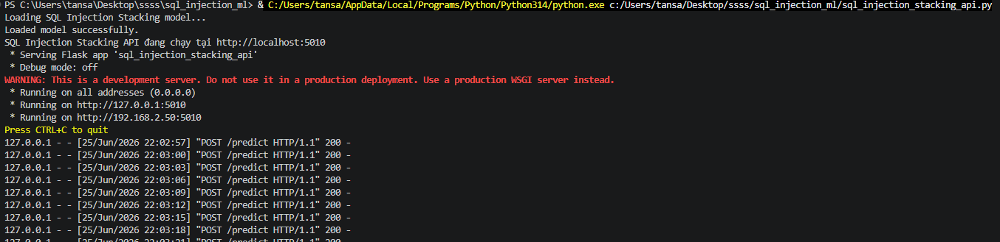
  <p><em>Model SQL Injection mới — Stacking Ensemble chạy tại port 5010</em></p>
</div>

<div align="center">
  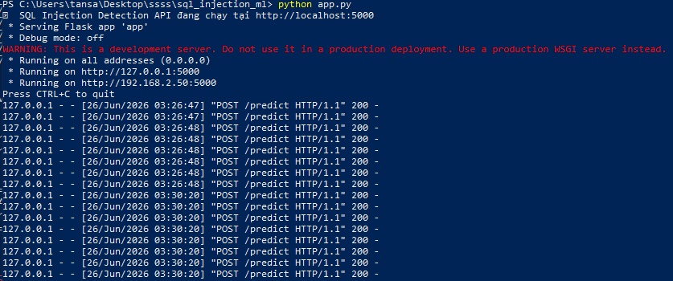
  <p><em>Model SQL Injection cũ — XGBoost chạy tại port 5000 để fallback</em></p>
</div>

<div align="center">
  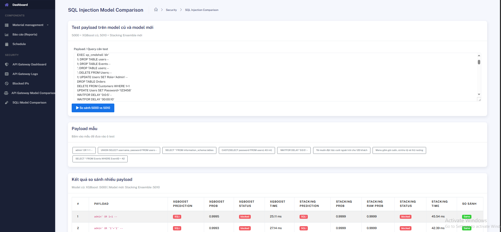
  <p><em>Trang so sánh SQL Injection: XGBoost :5000 vs Stacking :5010</em></p>
</div>

<div align="center">
  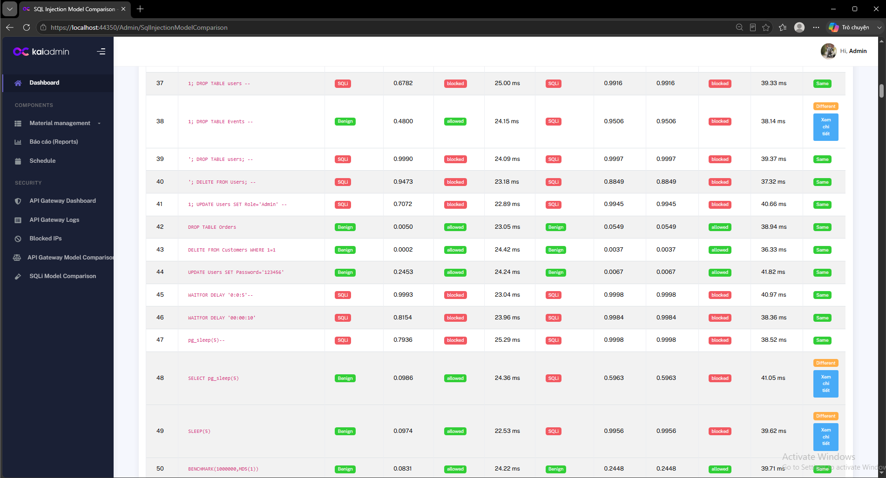
  <p><em>Kết quả so sánh nhiều payload SQL Injection giữa model cũ và model mới</em></p>
</div>

<div align="center">
  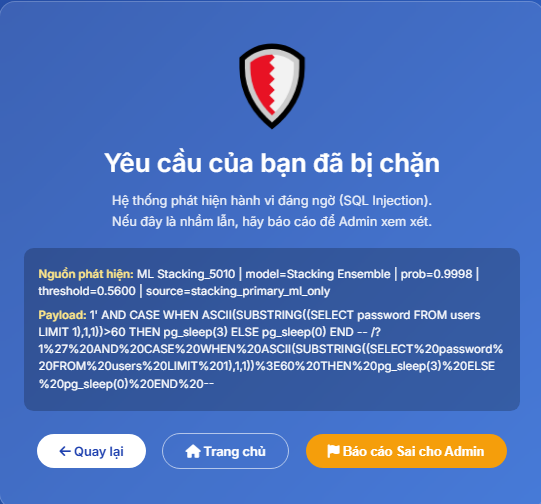
  <p><em>Trang bị chặn hiển thị rõ nguồn phát hiện: ML Stacking_5010</em></p>
</div>

<div align="center">
  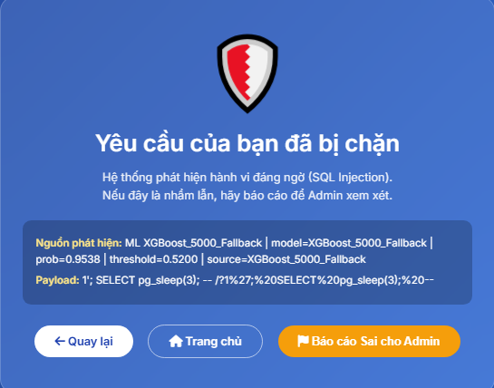
  <p><em>Khi model mới 5010 không dùng được, hệ thống fallback sang XGBoost 5000</em></p>
</div>

### Ảnh minh chứng nâng cấp API Gateway

<div align="center">
  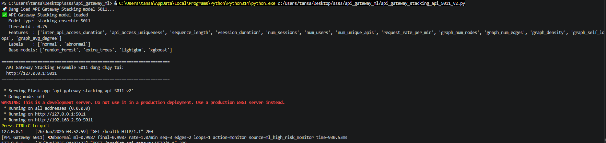
  <p><em>Model API Gateway mới — Stacking Ensemble chạy tại port 5011</em></p>
</div>

<div align="center">
  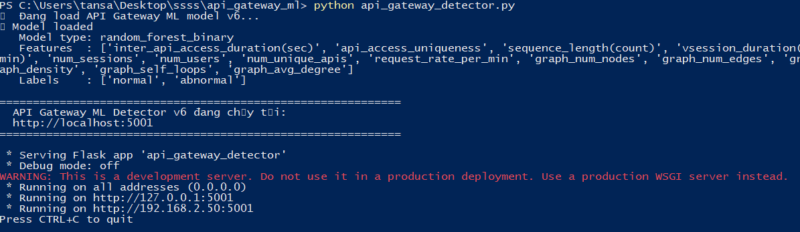
  <p><em>Model API Gateway cũ — RandomForest binary chạy tại port 5001 để fallback</em></p>
</div>

<div align="center">
  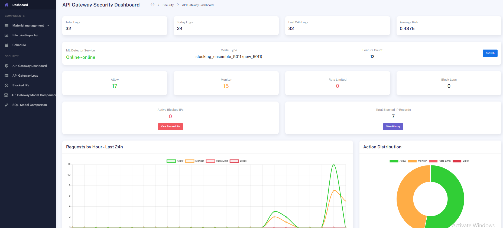
  <p><em>Dashboard nhận đúng model mới: stacking_ensemble_5011 (new_5011)</em></p>
</div>

<div align="center">
  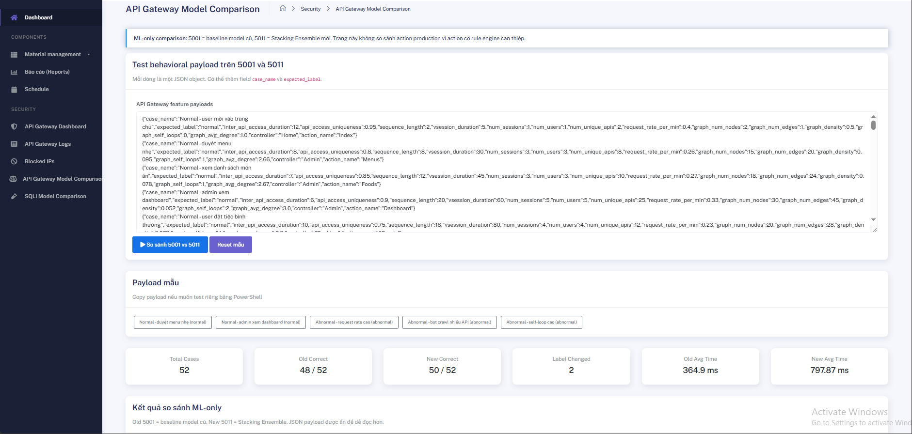
  <p><em>Trang API Gateway Model Comparison: 5001 baseline vs 5011 Stacking</em></p>
</div>

<div align="center">
  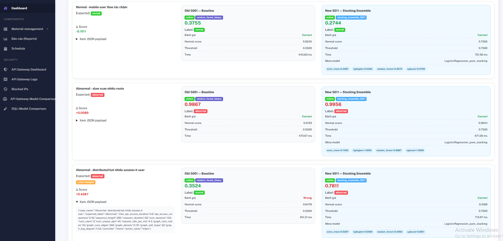
  <p><em>So sánh ML-only giữa Old 5001 và New 5011 Stacking Ensemble</em></p>
</div>

<div align="center">
  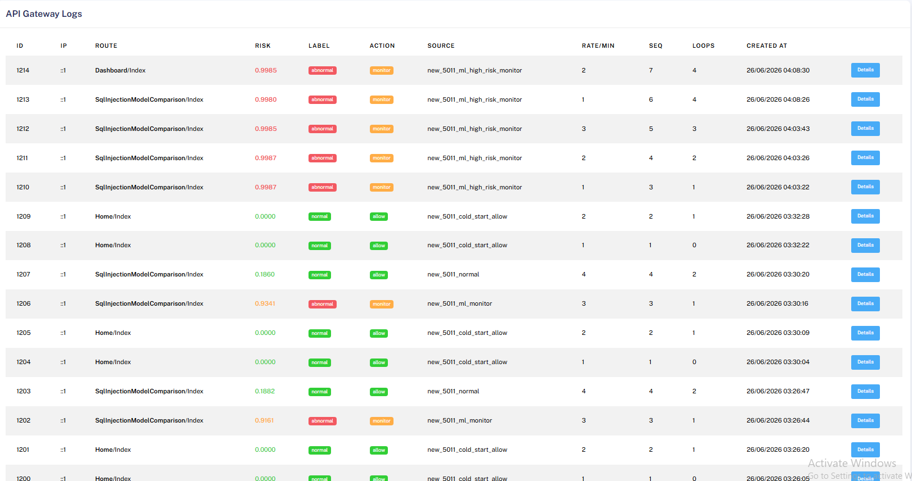
  <p><em>API Gateway Logs ghi rõ nguồn quyết định new_5011_...</em></p>
</div>

<div align="center">
  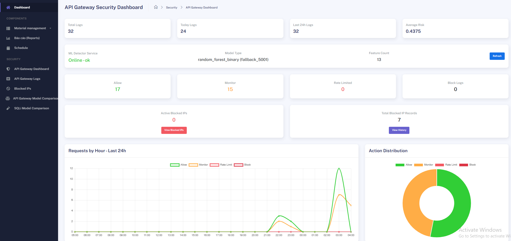
  <p><em>Khi 5011 tắt, Dashboard fallback sang random_forest_binary (fallback_5001)</em></p>
</div>

<div align="center">
  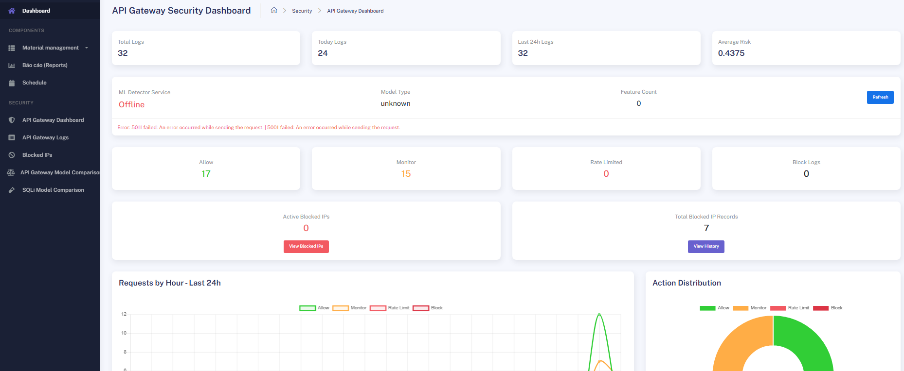
  <p><em>Khi cả 5011 và 5001 đều tắt, Dashboard báo Offline nhưng website vẫn hoạt động</em></p>
</div>

---

## 🏗️ Tổng quan kiến trúc bảo mật

Mọi request gửi đến eParty đi qua 2 lớp bảo vệ độc lập.

```text
Client Request
      │
      ▼
┌───────────────────────────────────────────────────────────────┐
│ LỚP 1 — SQL Injection Detection                               │
│ SqlInjectionFilter                                             │
│ Rule-based raw/normalized                                     │
│ Primary ML  : Stacking Ensemble Flask :5010 /predict           │
│ Fallback ML : XGBoost Flask :5000 /predict                     │
│ Admin Review: Telegram whitelist / bỏ qua                      │
└───────────────────────────────┬───────────────────────────────┘
                                │ nếu an toàn
                                ▼
┌───────────────────────────────────────────────────────────────┐
│ LỚP 2 — API Gateway Security                                  │
│ ApiGatewayMlFilter                                             │
│ Realtime behavior feature extraction                           │
│ Primary ML  : Stacking Ensemble Flask :5011 /predict-api-gateway│
│ Fallback ML : RandomForest Flask :5001 /predict-api-gateway    │
│ Rule Engine + Temporary Blocked IP + Telegram Alert            │
└───────────────────────────────┬───────────────────────────────┘
                                │ allow
                                ▼
                       Controller xử lý request
```

### Bảng tổng quan module

| | Module 1 — SQL Injection | Module 2 — API Gateway Security |
|---|---|---|
| **Bảo vệ** | Nội dung payload, query string, form body | Hành vi truy cập theo IP/session/rate/graph |
| **Model chính** | `5010` — Stacking Ensemble | `5011` — Stacking Ensemble |
| **Model fallback** | `5000` — XGBoost + TF-IDF | `5001` — RandomForest binary |
| **Endpoint chính** | `POST /predict` | `POST /predict-api-gateway` |
| **Endpoint so sánh** | `/Admin/SqlInjectionModelComparison` | `/Admin/ApiGatewayModelComparison` |
| **Action** | allow / block 403 | allow / monitor / challenge_or_rate_limit / block |
| **Admin Review** | Telegram Whitelist / Bỏ qua | Telegram Temporary Block alert |
| **Fail-safe** | 5010 lỗi → 5000 fallback → allow nếu cả hai lỗi | 5011 lỗi → 5001 fallback → allow/offline nếu cả hai lỗi |

---

## ⚙️ Yêu cầu hệ thống

| Thành phần | Yêu cầu |
|---|---|
| Hệ điều hành | Windows 10 / Windows 11 |
| IDE | Visual Studio 2022 |
| Framework | .NET Framework 4.8 |
| Python | 3.10 trở lên; đã test với Python 3.14 trên Windows |
| RAM | Tối thiểu 8GB, khuyến nghị 16GB trở lên |
| Database | SQL Server / LocalDB |
| Telegram | Bot Token + Chat ID |
| ngrok | Tùy chọn nếu muốn dùng Telegram webhook hoặc mở dashboard qua điện thoại |

### Python packages

```cmd
pip install flask pandas scikit-learn xgboost lightgbm joblib numpy matplotlib
```

> `lightgbm` dùng cho API Gateway Stacking 5011. Nếu chưa cài, script train có thể dùng fallback khác, nhưng bản demo hiện tại đã dùng LightGBM trong Stacking.

---

## 📂 Cấu trúc thư mục

```text
Repository root/
├── eParty/                         # ASP.NET MVC web project
├── sql_injection_ml/               # Module SQL Injection Flask APIs
├── api_gateway_ml/                 # Module API Gateway Flask APIs
├── docs/images/                    # Ảnh minh họa README
└── README.md
```

### eParty — phần web

```text
eParty/
├── App_Start/
│   └── FilterConfig.cs
│
├── Areas/Admin/
│   ├── Controllers/
│   │   ├── ApiGatewayDashboardController.cs
│   │   ├── ApiGatewayLogsController.cs
│   │   ├── BlockedIpsController.cs
│   │   ├── ApiGatewayModelComparisonController.cs
│   │   └── SqlInjectionModelComparisonController.cs
│   │
│   └── Views/
│       ├── ApiGatewayDashboard/Index.cshtml
│       ├── ApiGatewayLogs/Index.cshtml
│       ├── BlockedIps/Index.cshtml
│       ├── ApiGatewayModelComparison/Index.cshtml
│       ├── SqlInjectionModelComparison/Index.cshtml
│       └── Shared/_LayoutAdmin.cshtml
│
├── Controllers/
│   ├── SQLInjectionLogController.cs
│   ├── SqlInjectionTestController.cs
│   └── TelegramWebhookController.cs
│
├── Helpers/
│   ├── SqlInjectionFilter.cs
│   ├── ApiGatewayMlFilter.cs
│   └── TelegramHelper.cs
│
├── Models/
│   ├── SQLInjectionLog.cs
│   ├── PendingWhitelist.cs
│   ├── ApiGatewayLog.cs
│   ├── BlockedIp.cs
│   ├── ApiGatewayMlResult.cs
│   └── ApiGatewayHealthResult.cs
│
├── Service/
│   ├── ApiGatewayMlService.cs
│   ├── ApiGatewaySecurityService.cs
│   ├── ApiGatewayLogService.cs
│   ├── ApiGatewayTelegramAlertService.cs
│   └── BlockedIpService.cs
│
└── Views/Shared/
    └── SQLInjectionBlocked.cshtml
```

### sql_injection_ml

```text
sql_injection_ml/
├── app.py                         # Flask API cũ — XGBoost fallback :5000
├── sql_injection_detection.py     # Train XGBoost cũ
├── sql_injection_stacking_api.py  # Flask API mới — Stacking primary :5010
├── train_sql_injection_stacking.py# Train Stacking mới
├── Modified_SQL_Dataset.csv
└── models/
    ├── sql_injection_xgboost_model.pkl
    ├── tfidf_vectorizer.pkl
    ├── sql_injection_stacking_model.pkl
    └── tfidf_vectorizer_stacking.pkl
```

### api_gateway_ml

```text
api_gateway_ml/
├── api_gateway_detector.py              # Flask API cũ — RandomForest fallback :5001
├── train_api_gateway_model.py           # Train baseline v6
├── api_gateway_stacking_api_5011_v2.py  # Flask API mới — Stacking primary :5011
├── train_api_gateway_stacking_5011_v2.py# Train Stacking 5011
├── data/
│   ├── supervised_dataset.csv
│   ├── remaining_behavior_ext.csv
│   ├── supervised_call_graphs.json
│   └── remaining_call_graphs.json
└── models/
    ├── api_gateway_model.pkl
    ├── api_gateway_features.pkl
    ├── api_gateway_labels.pkl
    ├── api_gateway_model_type.pkl
    ├── api_gateway_stacking_model.pkl
    ├── api_gateway_features_stacking.pkl
    ├── api_gateway_threshold_stacking.pkl
    ├── api_gateway_model_type_stacking.pkl
    ├── api_gateway_labels_stacking.pkl
    └── api_gateway_base_models_stacking.pkl
```

---

## 🚀 Hướng dẫn cài đặt

### Bước 1 — Clone source

```cmd
git clone https://github.com/sangtran121/sql-injection-detection-ml.git
cd sql-injection-detection-ml
```

### Bước 2 — Tạo virtual environment

```cmd
python -m venv venv
venv\Scripts\activate
pip install flask pandas scikit-learn xgboost lightgbm joblib numpy matplotlib
```

### Bước 3 — Train SQL Injection models

```cmd
cd sql_injection_ml

python sql_injection_detection.py
python train_sql_injection_stacking.py
```

Kết quả cần có:

```text
models/sql_injection_xgboost_model.pkl
models/tfidf_vectorizer.pkl
models/sql_injection_stacking_model.pkl
models/tfidf_vectorizer_stacking.pkl
```

### Bước 4 — Train API Gateway models

```cmd
cd api_gateway_ml

python train_api_gateway_model.py
python train_api_gateway_stacking_5011_v2.py
```

Kết quả cần có:

```text
models/api_gateway_model.pkl
models/api_gateway_features.pkl
models/api_gateway_labels.pkl
models/api_gateway_model_type.pkl

models/api_gateway_stacking_model.pkl
models/api_gateway_features_stacking.pkl
models/api_gateway_threshold_stacking.pkl
models/api_gateway_model_type_stacking.pkl
models/api_gateway_labels_stacking.pkl
models/api_gateway_base_models_stacking.pkl
```

### Bước 5 — Cấu hình database

Trong Visual Studio → Package Manager Console:

```powershell
Update-Database
```

Các bảng chính:

```text
SQLInjectionLogs
PendingWhitelists
ApiGatewayLogs
BlockedIps
```

### Bước 6 — Cấu hình Telegram

Trong `Web.config`:

```xml
<add key="Telegram.BotToken" value="YOUR_BOT_TOKEN_HERE" />
<add key="Telegram.ChatId" value="YOUR_CHAT_ID_HERE" />
<add key="ApiGatewayTelegramAlert.Enabled" value="true" />
<add key="PublicBaseUrl" value="https://your-ngrok-url.ngrok-free.dev" />
```

Không commit token thật lên GitHub.

---

## ▶️ Chạy toàn bộ hệ thống

Nên mở 4 terminal riêng.

### Terminal 1 — SQL Injection Stacking 5010

```cmd
cd sql_injection_ml
..\venv\Scripts\activate
python sql_injection_stacking_api.py
```

Service:

```text
POST http://127.0.0.1:5010/predict
GET  http://127.0.0.1:5010/health
```

### Terminal 2 — SQL Injection XGBoost fallback 5000

```cmd
cd sql_injection_ml
..\venv\Scripts\activate
python app.py
```

Service:

```text
POST http://127.0.0.1:5000/predict
```

### Terminal 3 — API Gateway Stacking 5011

```cmd
cd api_gateway_ml
..\venv\Scripts\activate
python api_gateway_stacking_api_5011_v2.py
```

Service:

```text
POST http://127.0.0.1:5011/predict-api-gateway
POST http://127.0.0.1:5011/predict-api-gateway-ml-only
GET  http://127.0.0.1:5011/health
```

### Terminal 4 — API Gateway RandomForest fallback 5001

```cmd
cd api_gateway_ml
..\venv\Scripts\activate
python api_gateway_detector.py
```

Service:

```text
POST http://127.0.0.1:5001/predict-api-gateway
POST http://127.0.0.1:5001/predict-api-gateway-ml-only
GET  http://127.0.0.1:5001/health
```

### Terminal 5 — Website ASP.NET MVC

Trong Visual Studio:

```text
Set eParty as Startup Project → F5
```

Website:

```text
https://localhost:44350
```

---

# 🛡️ MODULE 1 — SQL Injection Detection

## Mục tiêu

Module này phát hiện SQL Injection trong:

- Query string
- Form input
- Payload POST
- URL encoded payload
- Payload obfuscated bằng comment `/**/`
- Payload time-based, union-based, error-based, tautology, command execution

## Luồng xử lý production

```text
Request
  │
  ▼
SqlInjectionFilter
  │
  ├── Bypass route nội bộ
  ├── Dynamic whitelist đã được admin duyệt?
  ├── Rule-based raw input
  ├── Normalize input: URL decode + strip comment + normalize whitespace
  ├── Rule-based normalized input
  ├── Vietnamese whitelist / benign business text
  ├── Primary ML: Stacking :5010
  ├── Fallback ML: XGBoost :5000
  └── Nếu nguy hiểm → Blocked page + Log + Telegram review
```

## Model mới — Stacking Ensemble 5010

File:

```text
sql_injection_stacking_api.py
train_sql_injection_stacking.py
```

### Thành phần model

| Thành phần | Vai trò |
|---|---|
| TF-IDF char n-gram | Trích xuất đặc trưng chuỗi SQL/payload |
| Logistic Regression | Base model 1 |
| Linear SVM calibrated | Base model 2 |
| XGBoost | Base model 3 |
| Logistic Regression | Meta model |
| Threshold | `0.56` |

Endpoint:

```text
POST http://127.0.0.1:5010/predict
GET  http://127.0.0.1:5010/health
```

Response mẫu:

```json
{
  "is_sql_injection": true,
  "probability": 0.9998,
  "raw_probability": 0.9998,
  "threshold": 0.56,
  "status": "blocked",
  "model": "Stacking Ensemble",
  "decision_source": "stacking_primary_ml_only",
  "base_model_scores": {
    "logistic_regression": 0.99,
    "linear_svm": 0.98,
    "xgboost": 1.0
  },
  "meta_model": "Logistic Regression"
}
```

## Model cũ — XGBoost fallback 5000

File:

```text
app.py
sql_injection_detection.py
```

Endpoint:

```text
POST http://127.0.0.1:5000/predict
```

Threshold fallback:

```text
0.52
```

## Trang so sánh model

URL:

```text
/Admin/SqlInjectionModelComparison
```

Mục đích:

- So sánh XGBoost `5000` và Stacking `5010`
- Kiểm thử nhiều payload cùng lúc
- Hiển thị probability, raw probability, response time, status
- Chỉ ra case model mới phát hiện được còn model cũ bỏ sót
- Có nút xem chi tiết khi hai model cho kết quả khác nhau

<div align="center">
  
</div>

## Blocked page có nguồn phát hiện

Khi request bị chặn, trang `SQLInjectionBlocked.cshtml` hiển thị:

- Nguồn phát hiện
- Model sử dụng
- Probability
- Threshold
- Payload đầy đủ
- Nút quay lại / về trang chủ / báo cáo sai cho admin

Ví dụ:

```text
Nguồn phát hiện: ML Stacking_5010 | model=Stacking Ensemble | prob=0.9998 | threshold=0.5600
```

<div align="center">
  
</div>

## Fallback SQL Injection

Khi `5010` tắt hoặc lỗi, C# service gọi fallback sang `5000`.

Ví dụ trên blocked page:

```text
Nguồn phát hiện: ML XGBoost_5000_Fallback | model=XGBoost_5000_Fallback | prob=0.9538 | threshold=0.5200
```

<div align="center">
  
</div>

## Admin review qua Telegram

Luồng cũ vẫn giữ nguyên:

```text
User bị block
  │
  ▼
Bấm "Báo cáo Sai cho Admin"
  │
  ▼
Telegram gửi payload + nút Whitelist/Bỏ qua
  │
  ▼
Admin bấm Whitelist
  │
  ▼
Webhook lưu whitelist
  │
  ▼
Blocked page polling và tự retry request
```


<div align="center">
  
</div>

---

# 🛡️ MODULE 2 — API Gateway Security

## Mục tiêu

Module này không kiểm tra nội dung SQL, mà kiểm tra **hành vi truy cập**:

- Spam request
- Flood cùng route
- Bot crawl nhiều API
- Slow scan nhiều route
- Credential stuffing
- API enumeration
- Graph bất thường
- Session/IP behavior bất thường

## Luồng xử lý production

```text
Request
  │
  ▼
ApiGatewayMlFilter
  │
  ├── Skip route nội bộ bảo mật
  ├── Trích xuất realtime features theo IP/session
  ├── Kiểm tra IP đang bị block?
  ├── Primary ML: Stacking :5011
  ├── Fallback ML: RandomForest :5001
  ├── Rule Engine quyết định allow/monitor/rate-limit/block
  ├── Temporary Blocked IP policy
  └── Ghi log + Dashboard + Telegram alert
```

## 13 realtime features

| Feature | Ý nghĩa |
|---|---|
| `inter_api_access_duration` | Thời gian giữa 2 request |
| `api_access_uniqueness` | Tỷ lệ API khác nhau đã truy cập |
| `sequence_length` | Số request trong chuỗi hiện tại |
| `vsession_duration` | Thời lượng virtual/session |
| `num_sessions` | Số session liên quan IP |
| `num_users` | Số user liên quan IP |
| `num_unique_apis` | Số API khác nhau |
| `request_rate_per_min` | Request/phút |
| `graph_num_nodes` | Số node graph |
| `graph_num_edges` | Số cạnh graph |
| `graph_density` | Mật độ graph |
| `graph_self_loops` | Số self-loop |
| `graph_avg_degree` | Bậc trung bình graph |

## Model mới — API Gateway Stacking 5011

File:

```text
api_gateway_stacking_api_5011_v2.py
train_api_gateway_stacking_5011_v2.py
```

Endpoint:

```text
POST http://127.0.0.1:5011/predict-api-gateway
POST http://127.0.0.1:5011/predict-api-gateway-ml-only
GET  http://127.0.0.1:5011/health
```

### Thành phần Stacking

| Thành phần | Vai trò |
|---|---|
| RandomForest | Base model |
| ExtraTrees | Base model |
| LightGBM | Base model |
| XGBoost | Base model |
| Logistic Regression | Meta model |
| Threshold | `0.75` |

Response production gồm:

```json
{
  "action": "monitor",
  "attack_score": 0.995,
  "decision_source": "ml_high_risk_monitor",
  "is_abnormal": true,
  "ml_risk_score": 0.995,
  "model": "stacking_ensemble_5011",
  "normal_score": 0.005,
  "predicted_label": "abnormal",
  "risk_score": 0.995,
  "rule_attack": false,
  "threshold": 0.75,
  "base_model_scores": {
    "random_forest": 0.9609,
    "extra_trees": 0.7467,
    "lightgbm": 1.0,
    "xgboost": 0.9996
  },
  "meta_model": "LogisticRegression_pure_stacking"
}
```

## Model cũ — API Gateway RandomForest fallback 5001

File:

```text
api_gateway_detector.py
train_api_gateway_model.py
```

Endpoint:

```text
POST http://127.0.0.1:5001/predict-api-gateway
POST http://127.0.0.1:5001/predict-api-gateway-ml-only
GET  http://127.0.0.1:5001/health
```

Model:

```text
random_forest_binary
```

Threshold fallback:

```text
0.55
```

## Dashboard API Gateway

URL:

```text
/Admin/ApiGatewayDashboard
```

Dashboard hiển thị:

- Tổng log
- Log hôm nay
- Log 24h
- Average risk
- ML Detector Service Online/Offline
- Model Type
- Feature Count
- Allow / Monitor / Rate Limited / Block
- Active Blocked IPs
- Biểu đồ request theo giờ
- Biểu đồ phân bố action

Model mới hoạt động:

<div align="center">
  
</div>

Fallback sang 5001:

<div align="center">
  
</div>

Cả 5011 và 5001 offline nhưng web vẫn load:

<div align="center">
  
</div>

## Trang so sánh API Gateway model

URL:

```text
/Admin/ApiGatewayModelComparison
```

Mục đích:

- So sánh old `5001 random_forest_binary`
- So sánh new `5011 stacking_ensemble_5011`
- Dùng endpoint `ml-only` để so sánh công bằng
- Không so sánh `action` production vì action còn bị rule engine can thiệp
- Hiển thị score từng base model và meta model

<div align="center">
  
</div>

## API Gateway Logs

URL:

```text
/Admin/ApiGatewayLogs
```

Cột chính:

- IP
- Route
- Risk
- Label
- Action
- Source
- Rate/min
- Sequence length
- Loops
- Created At

Ví dụ source mới:

```text
new_5011_ml_high_risk_monitor
new_5011_cold_start_allow
new_5011_normal
```

<div align="center">
  
</div>

## Rate-limit và Temporary Block

Luồng production:

```text
Request bình thường
  │
  ├── allow
  │
Request risk cao
  │
  ├── monitor
  │
Spam/flood vượt rule
  │
  ├── challenge_or_rate_limit / HTTP 429
  │
Spam tiếp tục
  │
  └── temporary block / HTTP 403
```


<div align="center">
  
</div>

## Temporary Blocked IPs

URL:

```text
/Admin/BlockedIps
```


<div align="center">
  
</div>

## Telegram alert API Gateway

Khi tạo temporary block:

- Gửi IP
- Route
- Source
- Risk
- Request rate
- Sequence length
- Graph self-loops
- Challenge count
- Blocked until
- Nút mở Dashboard/Blocked IPs nếu có `PublicBaseUrl`


<div align="center">
  
</div>

---

## 📊 Kết quả thực nghiệm nâng cấp

### SQL Injection

| Nội dung | Kết quả |
|---|---|
| Model cũ | XGBoost + TF-IDF, port 5000 |
| Model mới | Stacking Ensemble, port 5010 |
| Base models | Logistic Regression, Linear SVM calibrated, XGBoost |
| Meta model | Logistic Regression |
| Threshold mới | 0.56 |
| Fallback | Nếu 5010 lỗi → dùng XGBoost 5000 |
| Blocked page | Hiển thị `DetectedBy`, model, probability, threshold |

### API Gateway

Trên bộ kiểm thử mở rộng từ trang comparison:

| Chỉ số | Old 5001 RandomForest | New 5011 Stacking |
|---|---:|---:|
| Total cases | 52 | 52 |
| Correct | 48/52 | 50/52 |
| Label changed | \- | 2 |
| Avg response time | ~364.9 ms | ~797.87 ms |
| Mô hình | random_forest_binary | stacking_ensemble_5011 |

Nhận xét:

- New 5011 đúng nhiều case hơn Old 5001.
- New 5011 thường giảm risk score với normal traffic.
- New 5011 thường tăng risk score với abnormal traffic.
- New 5011 phát hiện đúng một số case mà 5001 bỏ sót, ví dụ distributed bot nhiều session ít user.
- New 5011 chậm hơn do phải chạy nhiều base learners và meta model.
- Vì vậy thiết kế tốt nhất là **5011 làm model chính, 5001 làm fallback**.

---

## 🛠️ Khắc phục lỗi chung

<details>
<summary><b>Không chạy được Flask vì thiếu thư viện</b></summary>

```cmd
pip install flask pandas scikit-learn xgboost lightgbm joblib numpy matplotlib
```
</details>

<details>
<summary><b>Không tìm thấy file model .pkl</b></summary>

Kiểm tra đúng thư mục:

```text
sql_injection_ml/models/
api_gateway_ml/models/
```

Nếu thiếu thì chạy lại script train tương ứng.
</details>

<details>
<summary><b>SQL Injection không gọi được 5010</b></summary>

Kiểm tra:

```cmd
python sql_injection_stacking_api.py
```

Sau đó test:

```powershell
Invoke-RestMethod `
  -Uri "http://127.0.0.1:5010/predict" `
  -Method Post `
  -ContentType "application/json" `
  -Body '{"query":"admin'' OR 1=1 --"}'
```
</details>

<details>
<summary><b>API Gateway không gọi được 5011</b></summary>

Kiểm tra:

```cmd
python api_gateway_stacking_api_5011_v2.py
```

Health check:

```powershell
Invoke-RestMethod -Uri "http://127.0.0.1:5011/health"
```
</details>

<details>
<summary><b>Dashboard API Gateway báo fallback_5001</b></summary>

Điều này có nghĩa là 5011 đang tắt hoặc lỗi. Hệ thống vẫn chạy vì tự fallback sang 5001.

Kiểm tra terminal 5011 và chạy lại:

```cmd
python api_gateway_stacking_api_5011_v2.py
```
</details>

<details>
<summary><b>Dashboard API Gateway báo Offline</b></summary>

Nghĩa là cả 5011 và 5001 đều không gọi được. Website vẫn load nhưng ML detector đang offline. Chạy lại ít nhất một service:

```cmd
python api_gateway_stacking_api_5011_v2.py
```

hoặc:

```cmd
python api_gateway_detector.py
```
</details>

<details>
<summary><b>Telegram không nhận tin nhắn</b></summary>

Kiểm tra:

```text
https://api.telegram.org/bot<TOKEN>/getMe
https://api.telegram.org/bot<TOKEN>/getUpdates
```

Nếu dùng webhook, kiểm tra:

```text
https://api.telegram.org/bot<TOKEN>/getWebhookInfo
```
</details>

<details>
<summary><b>ngrok bị Bad Request - Invalid Hostname</b></summary>

Chạy ngrok với:

```cmd
ngrok http --host-header=rewrite https://localhost:44350
```
</details>

---

## 📊 Kết quả tổng thể

| | SQL Injection | API Gateway |
|---|---|---|
| Model chính hiện tại | Stacking Ensemble :5010 | Stacking Ensemble :5011 |
| Model fallback | XGBoost :5000 | RandomForest binary :5001 |
| So sánh model | `/Admin/SqlInjectionModelComparison` | `/Admin/ApiGatewayModelComparison` |
| Bảo vệ | Payload SQL Injection | Hành vi request/API |
| Rule engine | Có | Có |
| Dashboard/log | SQLInjectionLog + Blocked Page + Telegram Review | Dashboard + Logs + Blocked IPs |
| Telegram | Whitelist/Bỏ qua false positive | Temporary Block alert |
| Fail-safe | 5010 lỗi → 5000 → allow nếu cả hai lỗi | 5011 lỗi → 5001 → offline/allow nếu cả hai lỗi |
| Điểm mạnh mới | Bắt payload obfuscated tốt hơn, có base/meta model | Bắt distributed bot/graph anomaly tốt hơn |
| Đánh đổi | Stacking chậm hơn XGBoost | Stacking chậm hơn RandomForest |

Hai module hoạt động độc lập. Nếu một module gặp sự cố, module còn lại vẫn tiếp tục bảo vệ website. Các Flask service có fallback để tránh tình trạng website bị đứng hoặc crash khi model chính bị tắt.


---

## 🤝 Đóng góp

Khi báo lỗi, vui lòng cung cấp:

- Module bị lỗi: SQL Injection hoặc API Gateway
- Payload hoặc request gây lỗi
- Ảnh chụp màn hình
- Log Flask terminal
- Log Visual Studio Output window

---

<div align="center">

Được xây dựng trong môn học Lập trình Web — **Nhóm eParty** 🎉

</div>
