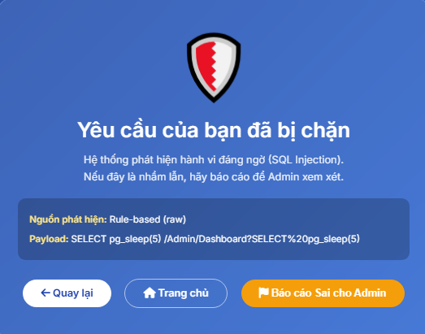

# 🛡️ eParty — Hệ thống bảo mật đa lớp với Machine Learning

Website quản lý dịch vụ tiệc cưới **eParty** (ASP.NET MVC) được tích hợp **2 lớp phòng thủ độc lập**, mỗi lớp có mô hình Machine Learning riêng để phát hiện và ngăn chặn tấn công theo thời gian thực. Phiên bản hiện tại đã được nâng cấp từ mô hình đơn sang **Stacking Ensemble**, đồng thời vẫn giữ mô hình cũ làm **fallback** để hệ thống không bị gián đoạn khi model mới tắt hoặc lỗi.

[](https://python.org)
[](https://flask.palletsprojects.com)
[](https://dotnet.microsoft.com)
[](https://xgboost.readthedocs.io)
[](https://lightgbm.readthedocs.io)
[](https://scikit-learn.org)
[](https://core.telegram.org/bots)

<div align="center">
  
  <p><em>Website quản lý dịch vụ tiệc cưới eParty — PartyServ</em></p>
</div>

---

## 📑 Mục lục

- [Tổng quan kiến trúc bảo mật](#️-tổng-quan-kiến-trúc-bảo-mật)
- [Điểm nâng cấp chính](#-điểm-nâng-cấp-chính)
- [Yêu cầu hệ thống](#️-yêu-cầu-hệ-thống)
- [Cấu trúc thư mục](#-cấu-trúc-thư-mục)
- [Hướng dẫn cài đặt](#-hướng-dẫn-cài-đặt)
- [Chạy toàn bộ hệ thống](#️-chạy-toàn-bộ-hệ-thống)
- [MODULE 1 — SQL Injection Detection](#️-module-1--sql-injection-detection)
- [MODULE 2 — API Gateway Security](#️-module-2--api-gateway-security)
- [Khắc phục lỗi chung](#️-khắc-phục-lỗi-chung)
- [Kết quả tổng thể](#-kết-quả-tổng-thể)
- [Đóng góp](#-đóng-góp)

---

## 🏗️ Tổng quan kiến trúc bảo mật

Mọi request gửi đến eParty đi qua **2 lớp phòng thủ độc lập**. Mỗi lớp có model chính mới, model cũ làm fallback, rule engine, logging và dashboard riêng.

```text
                        Client Request
                              │
                              ▼
        ┌─────────────────────────────────────────────┐
        │   LỚP 1 — SqlInjectionFilter                │
        │   Rule-based + ML SQL Injection Detection   │
        │                                             │
        │   Primary :5010 — Stacking Ensemble          │
        │   Fallback :5000 — XGBoost                  │
        │   → Phát hiện SQL Injection trong payload    │
        └───────────────────┬───────────────────────────┘
                              │ an toàn
                              ▼
        ┌─────────────────────────────────────────────┐
        │   LỚP 2 — ApiGatewayMlFilter                │
        │   Realtime Behavior + API Gateway ML        │
        │                                             │
        │   Primary :5011 — Stacking Ensemble          │
        │   Fallback :5001 — RandomForest binary       │
        │   → Phát hiện spam/flood/bot theo hành vi    │
        └───────────────────┬───────────────────────────┘
                              │ allow
                              ▼
                    Controller xử lý ✅
```

| | Module 1 — SQL Injection | Module 2 — API Gateway Security |
|---|---|---|
| **Bảo vệ** | Nội dung payload, form, query string | Hành vi truy cập, rate, session, graph API |
| **Model chính** | Stacking Ensemble `:5010` | Stacking Ensemble `:5011` |
| **Model fallback** | XGBoost `:5000` | RandomForest binary `:5001` |
| **So sánh model** | `/Admin/SqlInjectionModelComparison` | `/Admin/ApiGatewayModelComparison` |
| **Action** | allow / block 403 | allow / monitor / rate-limit 429 / block 403 |
| **Admin Review** | Telegram Whitelist / Bỏ qua | Telegram Temporary Block alert |
| **Fail-safe** | 5010 lỗi → fallback 5000; cả hai lỗi → cho qua | 5011 lỗi → fallback 5001; cả hai lỗi → web vẫn load |

---

## ✨ Điểm nâng cấp chính

### ✅ Nâng cấp SQL Injection

- Thêm model mới **Stacking Ensemble** chạy tại port `5010`.
- Giữ model cũ **XGBoost** tại port `5000` làm fallback.
- `SqlInjectionFilter` ưu tiên gọi `5010`, nếu lỗi thì tự fallback về `5000`.
- Trang blocked page hiển thị rõ nguồn phát hiện: `ML Stacking_5010` hoặc `ML XGBoost_5000_Fallback`.
- Thêm trang so sánh model: `/Admin/SqlInjectionModelComparison`.

### ✅ Nâng cấp API Gateway

- Thêm model mới **Stacking Ensemble 5011** gồm:
  - `RandomForest`
  - `ExtraTrees`
  - `LightGBM`
  - `XGBoost`
  - Meta model: `LogisticRegression_pure_stacking`
- Giữ model cũ **RandomForest binary 5001** làm fallback.
- `ApiGatewayMlService` ưu tiên gọi `5011`, nếu lỗi thì fallback sang `5001`.
- Thêm endpoint ML-only cho so sánh công bằng:
  - `5001/predict-api-gateway-ml-only`
  - `5011/predict-api-gateway-ml-only`
- Thêm trang so sánh: `/Admin/ApiGatewayModelComparison`.
- Dashboard hiển thị model đang dùng: `stacking_ensemble_5011 (new_5011)` hoặc `random_forest_binary (fallback_5001)`.

---

## ⚙️ Yêu cầu hệ thống

| Thành phần | Yêu cầu |
|-----------|---------|
| Hệ điều hành | Windows 10 / Windows 11 |
| IDE | Visual Studio 2022 |
| Framework | .NET Framework 4.8 |
| Python | Python 3.10+ *(đã test với Python 3.14 trên Windows)* |
| RAM | Tối thiểu 8GB, khuyến nghị 16GB+ |
| Telegram | Bot token + Chat ID |
| ngrok | Tùy chọn, dùng cho Telegram button / webhook |

---

## 📂 Cấu trúc thư mục

```text
Repository root/
├── eParty/                           ← ASP.NET MVC web project
├── sql_injection_ml/                 ← Flask ML Module 1
├── api_gateway_ml/                   ← Flask ML Module 2
└── docs/images/                      ← Ảnh minh họa README
```

### Web project `eParty/`

```text
eParty/
├── App_Start/
│   └── FilterConfig.cs
│
├── Areas/Admin/
│   ├── Controllers/
│   │   ├── ApiGatewayDashboardController.cs
│   │   ├── ApiGatewayLogsController.cs
│   │   ├── BlockedIpsController.cs
│   │   ├── ApiGatewayModelComparisonController.cs
│   │   └── SqlInjectionModelComparisonController.cs
│   │
│   └── Views/
│       ├── ApiGatewayDashboard/Index.cshtml
│       ├── ApiGatewayLogs/Index.cshtml
│       ├── BlockedIps/Index.cshtml
│       ├── ApiGatewayModelComparison/Index.cshtml
│       ├── SqlInjectionModelComparison/Index.cshtml
│       └── Shared/_LayoutAdmin.cshtml
│
├── Controllers/
│   ├── SQLInjectionLogController.cs
│   ├── SqlInjectionTestController.cs
│   └── TelegramWebhookController.cs
│
├── Helpers/
│   ├── SqlInjectionFilter.cs
│   ├── ApiGatewayMlFilter.cs
│   └── TelegramHelper.cs
│
├── Models/
│   ├── SQLInjectionLog.cs
│   ├── PendingWhitelist.cs
│   ├── ApiGatewayLog.cs
│   ├── BlockedIp.cs
│   ├── ApiGatewayMlResult.cs
│   └── ApiGatewayHealthResult.cs
│
├── Service/
│   ├── ApiGatewayMlService.cs
│   ├── ApiGatewaySecurityService.cs
│   ├── ApiGatewayLogService.cs
│   ├── ApiGatewayTelegramAlertService.cs
│   └── BlockedIpService.cs
│
└── Views/Shared/SQLInjectionBlocked.cshtml
```

### Python services

```text
sql_injection_ml/
├── app.py                              ← XGBoost fallback API :5000
├── sql_injection_stacking_api.py       ← Stacking primary API :5010
├── Modified_SQL_Dataset.csv
└── models/
    ├── sql_injection_xgboost_model.pkl
    ├── tfidf_vectorizer.pkl
    ├── sql_injection_stacking_model.pkl
    └── tfidf_vectorizer_stacking.pkl

api_gateway_ml/
├── api_gateway_detector.py             ← RandomForest fallback API :5001
├── api_gateway_stacking_api_5011_v2.py  ← Stacking primary API :5011
├── train_api_gateway_model.py
├── train_api_gateway_stacking_5011_v2.py
└── models/
    ├── api_gateway_model.pkl
    ├── api_gateway_features.pkl
    ├── api_gateway_labels.pkl
    ├── api_gateway_model_type.pkl
    ├── api_gateway_stacking_model_5011.pkl
    ├── api_gateway_stacking_scaler_5011.pkl
    └── api_gateway_stacking_metadata_5011.pkl
```

> Tên file `.pkl` có thể khác tùy phiên bản code, nhưng cần đảm bảo các file model/vectorizer/scaler/metadata nằm đúng trong thư mục `models/` của từng Flask service.

---

## 🚀 Hướng dẫn cài đặt

### Bước 1 — Tải source code

```bash
git clone https://github.com/sangtran121/sql-injection-detection-ml.git
cd sql-injection-detection-ml
```

Hoặc nhấn **Code → Download ZIP**, giải nén ra thư mục dễ nhớ.

---

### Bước 2 — Cài đặt Python & thư viện

```cmd
python -m venv venv
venv\Scripts\activate

pip install flask pandas scikit-learn xgboost lightgbm joblib numpy
```

---

### Bước 3 — Train hoặc kiểm tra model

Nếu repository đã có sẵn file `.pkl`, có thể bỏ qua bước train và chạy Flask trực tiếp.

**SQL Injection — model cũ XGBoost:**

```cmd
cd sql_injection_ml
python sql_injection_detection.py
```

**API Gateway — model cũ RandomForest:**

```cmd
cd api_gateway_ml
python train_api_gateway_model.py
```

**API Gateway — model mới Stacking 5011:**

```cmd
cd api_gateway_ml
python train_api_gateway_stacking_5011_v2.py
```

> Với SQL Injection Stacking `5010`, cần đảm bảo trong `sql_injection_ml/models/` có:
> - `sql_injection_stacking_model.pkl`
> - `tfidf_vectorizer_stacking.pkl`

---

### Bước 4 — Cấu hình database

Mở **Package Manager Console** trong Visual Studio:

```powershell
Update-Database
```

Nếu chưa có migration thì tạo migration tương ứng cho:

```text
SQLInjectionLogs
PendingWhitelists
ApiGatewayLogs
BlockedIps
```

---

### Bước 5 — Cấu hình Telegram Bot & Web.config

Trong `Web.config`:

```xml
<add key="Telegram.BotToken" value="YOUR_BOT_TOKEN_HERE" />
<add key="Telegram.ChatId" value="YOUR_CHAT_ID_HERE" />
<add key="ApiGatewayTelegramAlert.Enabled" value="true" />
<add key="PublicBaseUrl" value="https://your-ngrok-url.ngrok-free.dev" />
```

> Không commit token thật, Gmail App Password hoặc secret lên GitHub.

---

### Bước 6 — Build web project

1. Mở `eParty.sln` bằng Visual Studio 2022.
2. Restore NuGet Packages.
3. Build solution bằng `Ctrl + Shift + B`.

---

## ▶️ Chạy toàn bộ hệ thống

Khuyến nghị chạy đủ 4 Flask service để kiểm tra cả model mới và fallback.

### 1️⃣ SQL Injection primary — Stacking `5010`

```cmd
cd sql_injection_ml
..\venv\Scripts\activate
python sql_injection_stacking_api.py
```

> 🖼️ **SQL Injection Stacking API chạy tại port 5010:**
>
> 

### 2️⃣ SQL Injection fallback — XGBoost `5000`

```cmd
cd sql_injection_ml
..\venv\Scripts\activate
python app.py
```

> 🖼️ **SQL Injection XGBoost fallback chạy tại port 5000:**
>
> 

### 3️⃣ API Gateway primary — Stacking `5011`

```cmd
cd api_gateway_ml
..\venv\Scripts\activate
python api_gateway_stacking_api_5011_v2.py
```

> 🖼️ **API Gateway Stacking Ensemble 5011 đang chạy:**
>
> 

### 4️⃣ API Gateway fallback — RandomForest `5001`

```cmd
cd api_gateway_ml
..\venv\Scripts\activate
python api_gateway_detector.py
```

> 🖼️ **API Gateway RandomForest fallback 5001 đang chạy:**
>
> 

### 5️⃣ Khởi động Website ASP.NET

Trong Visual Studio: chuột phải `eParty` → **Set as Startup Project** → `F5`.

Website mở tại:

```text
https://localhost:44350
```

---

# 🛡️ MODULE 1 — SQL Injection Detection

Module SQL Injection phát hiện và ngăn chặn tấn công SQL Injection theo thời gian thực bằng nhiều lớp:

- **Rule-based Filter:** chặn ngay các pattern rõ ràng.
- **ML chính — Stacking Ensemble 5010:** phân loại payload bằng mô hình ensemble.
- **ML fallback — XGBoost 5000:** dùng khi model 5010 tắt hoặc lỗi.
- **Admin Review qua Telegram:** cho phép whitelist false positive theo thời gian thực.
- **Blocked Page:** hiển thị nguồn phát hiện và cho phép người dùng báo cáo sai.

## 🔄 Luồng xử lý SQL Injection

```text
Request
  │
  ▼
SqlInjectionFilter
  │
  ├─ Dynamic Whitelist?
  ├─ Rule-based raw?
  ├─ Normalize input?
  ├─ Rule-based normalized?
  ├─ Vietnamese whitelist?
  ├─ ML Primary :5010 Stacking?
  └─ ML Fallback :5000 XGBoost?
        │
        ├─ SQLi → Block 403 + Log + Telegram review
        └─ Benign → Allow
```

## 🤖 Model SQL Injection

| Thành phần | Bản cũ | Bản mới |
|---|---|---|
| Port | `5000` | `5010` |
| Model | XGBoost + TF-IDF | Stacking Ensemble + TF-IDF |
| Vai trò | Fallback | Primary |
| Endpoint | `/predict` | `/predict` |
| Fallback | Không | Nếu 5010 lỗi → gọi 5000 |

## 🧪 Trang so sánh model

Truy cập:

```text
/Admin/SqlInjectionModelComparison
```

Trang này so sánh trực tiếp model cũ `5000 XGBoost` và model mới `5010 Stacking`.

> 🖼️ **Trang SQL Injection Model Comparison:**
>
> 

> 🖼️ **Kết quả so sánh nhiều payload SQL Injection:**
>
> 

## 🚫 Blocked Page hiển thị nguồn phát hiện

Khi payload bị chặn, trang 403 hiển thị rõ:

- Nguồn phát hiện.
- Model đang dùng.
- Probability.
- Threshold.
- Payload đầy đủ.
- Nút báo cáo sai cho Admin.

> 🖼️ **Blocked Page khi model mới 5010 phát hiện SQL Injection:**
>
> 

## 🔁 Fallback SQL Injection

Khi `5010` tắt nhưng `5000` vẫn chạy, hệ thống tự động fallback sang XGBoost.

> 🖼️ **Blocked Page khi fallback sang XGBoost 5000:**
>
> 

## 📲 Telegram Review

SQL Injection vẫn hỗ trợ Telegram Review:

```text
User bị chặn → Báo cáo sai → Telegram alert → Admin bấm Whitelist → Auto retry
```

Ảnh cũ vẫn dùng được:

> 

---

# 🛡️ MODULE 2 — API Gateway Security

Module API Gateway tập trung vào **hành vi truy cập** thay vì nội dung payload: rate, session, sequence, graph API, self-loop, số API duy nhất, số user/session theo IP.

Phiên bản hiện tại dùng:

- **ML chính — Stacking Ensemble 5011**
- **ML fallback — RandomForest binary 5001**
- **Rule Engine production**
- **Temporary Blocked IP**
- **Dashboard realtime**
- **Telegram Alert**
- **ML-only comparison page**

## 🧠 Realtime Features (13 features)

| Feature | Ý nghĩa |
|---|---|
| `inter_api_access_duration` | Thời gian giữa 2 request liên tiếp |
| `api_access_uniqueness` | Tỷ lệ API khác nhau đã truy cập |
| `sequence_length` | Số request trong chuỗi hiện tại |
| `vsession_duration` | Thời lượng session |
| `num_sessions` | Số session đang hoạt động theo IP |
| `num_users` | Số user đang hoạt động theo IP |
| `num_unique_apis` | Số API khác nhau đã gọi |
| `request_rate_per_min` | Số request/phút |
| `graph_num_nodes` | Số node trong graph API |
| `graph_num_edges` | Số cạnh trong graph API |
| `graph_density` | Mật độ graph |
| `graph_self_loops` | Số lần gọi lặp lại cùng API |
| `graph_avg_degree` | Bậc trung bình của graph |

## 🤖 Model API Gateway

| Thành phần | Bản cũ | Bản mới |
|---|---|---|
| Port | `5001` | `5011` |
| Model | RandomForest binary | Stacking Ensemble |
| Vai trò | Fallback | Primary |
| Endpoint production | `/predict-api-gateway` | `/predict-api-gateway` |
| Endpoint so sánh | `/predict-api-gateway-ml-only` | `/predict-api-gateway-ml-only` |
| Feature count | 13 | 13 |
| Labels | normal / abnormal | normal / abnormal |

Stacking `5011` sử dụng các base model:

```text
RandomForest + ExtraTrees + LightGBM + XGBoost
Meta model: LogisticRegression_pure_stacking
```

## 📊 Dashboard API Gateway

Truy cập:

```text
/Admin/ApiGatewayDashboard
```

Dashboard hiển thị:

- Tổng log, log trong ngày, log 24h, average risk.
- ML detector online/offline.
- Model type hiện tại.
- Feature count.
- Allow / Monitor / Rate Limited / Block Logs.
- Active Blocked IPs.
- Biểu đồ request theo giờ.
- Action distribution.

> 🖼️ **Dashboard khi model mới 5011 đang active:**
>
> 

## 🧪 Trang so sánh API Gateway Model

Truy cập:

```text
/Admin/ApiGatewayModelComparison
```

Trang này so sánh `Old 5001 — RandomForest binary` với `New 5011 — Stacking Ensemble` bằng endpoint **ML-only**, không lấy `action production`, để tránh rule engine làm sai kết quả so sánh.

> 🖼️ **Trang API Gateway Model Comparison:**
>
> 

> 🖼️ **Kết quả so sánh 5001 và 5011:**
>
> 

Kết quả thực nghiệm từ các bộ test mở rộng:

| Bộ test | Old 5001 | New 5011 |
|---|---:|---:|
| 24 kịch bản | 22/24 | 23/24 |
| 30 kịch bản | 28/30 | 29/30 |
| 52 kịch bản tổng hợp | 48/52 | 50/52 |

Nhận xét:

- 5011 giảm risk score với traffic bình thường.
- 5011 tăng risk score với nhiều traffic bất thường.
- 5011 phát hiện đúng một số case mà 5001 bỏ sót, ví dụ distributed bot nhiều session ít user.
- 5011 chậm hơn do phải chạy nhiều base model và meta model.

## 📋 API Gateway Logs

Truy cập:

```text
/Admin/ApiGatewayLogs
```

Logs hiển thị `DecisionSource`, ví dụ:

```text
new_5011_normal
new_5011_cold_start_allow
new_5011_ml_high_risk_monitor
fallback_5001_normal
fallback_5001_ml_monitor
```

> 🖼️ **API Gateway Logs ghi nhận request được xử lý bởi 5011:**
>
> 

## 🔁 Fallback API Gateway

Khi `5011` tắt nhưng `5001` vẫn chạy, dashboard hiển thị model fallback:

```text
random_forest_binary (fallback_5001)
```

> 🖼️ **Dashboard khi fallback sang model cũ 5001:**
>
> 

Khi cả `5011` và `5001` đều tắt, website vẫn load được. Dashboard báo Offline nhưng không làm sập hệ thống.

> 🖼️ **Cả 5011 và 5001 offline nhưng website vẫn hoạt động:**
>
> 

## 🚫 Temporary Blocked IPs

API Gateway vẫn giữ chức năng rate-limit và temporary block:

```text
normal request → allow
spam request → challenge_or_rate_limit 429
tiếp tục spam → block 403 + temporary blocked IP
```

Ảnh cũ vẫn dùng được:

> 

## 📲 Telegram Alert

Khi tạo temporary block mới, Telegram gửi cảnh báo realtime kèm nút mở:

- Blocked IPs.
- API Gateway Dashboard.

Ảnh cũ vẫn dùng được:

> 

---

## 🛠️ Khắc phục lỗi chung

<details>
<summary><b>❌ Lỗi: No module named flask / xgboost / lightgbm / sklearn</b></summary>

Chạy:

```cmd
pip install flask pandas scikit-learn xgboost lightgbm joblib numpy
```

</details>

<details>
<summary><b>❌ Lỗi: Không tìm thấy file .pkl</b></summary>

Kiểm tra thư mục model:

```text
sql_injection_ml/models/
api_gateway_ml/models/
```

Đảm bảo model, vectorizer, scaler, metadata nằm đúng vị trí.

</details>

<details>
<summary><b>❌ Website vẫn load nhưng Dashboard báo ML Offline</b></summary>

Đây là hành vi đúng nếu Flask service chưa chạy hoặc bị tắt. Hệ thống được thiết kế fail-safe:

```text
5010 lỗi → fallback 5000
5011 lỗi → fallback 5001
cả hai API Gateway ML lỗi → web vẫn load, dashboard báo Offline
```

</details>

<details>
<summary><b>❌ API Gateway tự chặn trang quản trị bảo mật</b></summary>

Cần skip các route nội bộ trong `ApiGatewayMlFilter`, ví dụ:

```text
ApiGatewayDashboard
ApiGatewayLogs
BlockedIps
ApiGatewayModelComparison
SqlInjectionLog
Account
```

Nếu không skip, các trang dashboard/log/polling có thể tạo request lặp và gây false positive.

</details>

<details>
<summary><b>❌ Nút Telegram không hoạt động</b></summary>

Kiểm tra:

```text
PublicBaseUrl
ngrok URL
Telegram webhook
BotToken
ChatId
```

Nếu ngrok đổi URL, phải cập nhật `PublicBaseUrl` và đăng ký lại webhook.

</details>

---

## 📊 Kết quả tổng thể

| | Module 1 — SQL Injection | Module 2 — API Gateway Security |
|---|---|---|
| Model chính | Stacking Ensemble `:5010` | Stacking Ensemble `:5011` |
| Model fallback | XGBoost `:5000` | RandomForest binary `:5001` |
| Kiểu phát hiện | Payload SQL Injection | Hành vi truy cập API |
| So sánh model | `/Admin/SqlInjectionModelComparison` | `/Admin/ApiGatewayModelComparison` |
| Action | Block 403 + Telegram Review | Monitor / 429 Rate Limit / 403 Temporary Block |
| Logging | `SQLInjectionLogs` | `ApiGatewayLogs`, `BlockedIps` |
| Dashboard | SQL Injection Log / Comparison | Dashboard / Logs / Blocked IPs / Comparison |
| Fail-safe | 5010 lỗi → 5000 fallback | 5011 lỗi → 5001 fallback; cả hai lỗi → web vẫn load |

Hai module hoạt động **độc lập**. Nếu một lớp hoặc một Flask API gặp sự cố, website vẫn hoạt động bình thường và lớp còn lại tiếp tục bảo vệ hệ thống.

---

## ✅ Kết luận

Dự án đã hoàn thiện hai nâng cấp chính:

```text
SQL Injection:
XGBoost 5000 → Stacking Ensemble 5010
Giữ XGBoost 5000 làm fallback

API Gateway:
RandomForest 5001 → Stacking Ensemble 5011
Giữ RandomForest 5001 làm fallback
```

Mô hình mới cho khả năng phát hiện tốt hơn trong các bộ test mở rộng, đặc biệt với các hành vi bất thường tinh vi. Tuy nhiên, hệ thống vẫn giữ model cũ làm fallback để đảm bảo tính ổn định và khả năng phục hồi khi model mới tắt hoặc lỗi.

---

## 🤝 Đóng góp

Nếu gặp lỗi hoặc muốn cải thiện, hãy mở Issue kèm:

- Ảnh chụp màn hình lỗi.
- Payload / request gây lỗi.
- Dòng log trong Flask console hoặc Output window của Visual Studio.
- Ghi rõ lỗi thuộc SQL Injection, API Gateway, Telegram hay Dashboard.

---

<div align="center">

Được xây dựng trong môn học Lập trình Web — **Nhóm eParty** 🎉

</div>
