# 🛡️ eParty — Hệ thống bảo mật đa lớp với Machine Learning

Website quản lý dịch vụ tiệc cưới **eParty** (ASP.NET MVC) được tích hợp **2 lớp phòng thủ độc lập**, mỗi lớp sử dụng một mô hình Machine Learning riêng để phát hiện và ngăn chặn tấn công theo thời gian thực — kết hợp Rule Engine, Admin Review qua Telegram và Dashboard giám sát trực quan.

[](https://python.org)
[](https://flask.palletsprojects.com)
[](https://xgboost.readthedocs.io)
[](https://scikit-learn.org)
[](https://dotnet.microsoft.com)
[](https://core.telegram.org/bots)

<div align="center">
  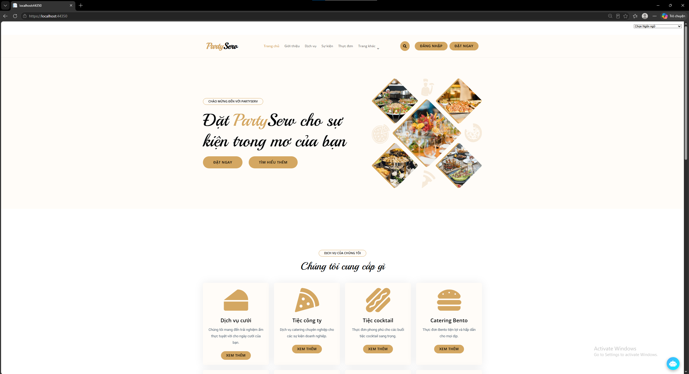
  <p><em>Website quản lý dịch vụ tiệc cưới eParty — PartyServ</em></p>
</div>

---

## 📑 Mục lục

- [Tổng quan kiến trúc bảo mật](#-tổng-quan-kiến-trúc-bảo-mật)
- [Yêu cầu hệ thống](#️-yêu-cầu-hệ-thống)
- [Cấu trúc thư mục](#-cấu-trúc-thư-mục)
- [Hướng dẫn cài đặt](#-hướng-dẫn-cài-đặt)
- [Chạy toàn bộ hệ thống](#️-chạy-toàn-bộ-hệ-thống)
- [MODULE 1 — SQL Injection Detection](#️-module-1--sql-injection-detection)
- [MODULE 2 — API Gateway Security](#️-module-2--api-gateway-security)
- [Khắc phục lỗi chung](#️-khắc-phục-lỗi-chung)
- [Kết quả tổng thể](#-kết-quả-tổng-thể)
- [Đóng góp](#-đóng-góp)

---

## 🏗️ Tổng quan kiến trúc bảo mật

Mọi request gửi đến eParty sẽ đi qua **2 lớp phòng thủ độc lập**, mỗi lớp có Flask ML API, dashboard và rule engine riêng:

```
                        Client Request
                              │
                              ▼
        ┌─────────────────────────────────────────────┐
        │   LỚP 1 — SqlInjectionFilter                │
        │   Rule-based + XGBoost (TF-IDF)              │
        │   Flask :5000  /predict                      │
        │   → Phát hiện SQL Injection trong payload    │
        └───────────────────┬───────────────────────────┘
                              │ an toàn
                              ▼
        ┌─────────────────────────────────────────────┐
        │   LỚP 2 — ApiGatewayMlFilter                │
        │   Realtime Behavior + RandomForest           │
        │   Flask :5001  /predict-api-gateway          │
        │   → Phát hiện spam / flood / bot theo        │
        │     hành vi truy cập (rate, session...)      │
        └───────────────────┬───────────────────────────┘
                              │ allow
                              ▼
                    Controller xử lý ✅
```

| | Module 1 — SQL Injection | Module 2 — API Gateway Security |
|---|---|---|
| **Bảo vệ** | Nội dung payload (form, query string) | Hành vi truy cập (rate, session, sequence) |
| **Model** | XGBoost + TF-IDF | RandomForest (binary normal/abnormal) |
| **Flask port** | `5000` | `5001` |
| **Action** | allow / block (403) | allow / monitor / rate-limit (429) / block (403) |
| **Admin Review** | Telegram Whitelist / Bỏ qua | Telegram Temporary Block alert |
| **Dashboard** | `/SQLInjectionLog` | `/Admin/ApiGatewayDashboard`, `/Admin/ApiGatewayLogs`, `/Admin/BlockedIps` |

---

## ⚙️ Yêu cầu hệ thống

| Thành phần | Yêu cầu |
|-----------|---------|
| Hệ điều hành | Windows 10 / Windows 11 |
| IDE | Visual Studio 2022 (Community Edition) |
| Framework | .NET Framework 4.8 |
| Python | **3.10 trở lên** *(khuyến nghị 3.10/3.11; đã test với Python 3.14 trên Windows)* |
| RAM | Tối thiểu 8GB *(khuyến nghị 16GB)* |
| Telegram | Bot token + Chat ID (dùng chung cho cả 2 module) |
| ngrok | Tùy chọn — cần nếu muốn bấm nút Telegram / mở Dashboard từ điện thoại |

---

## 📂 Cấu trúc thư mục

```
Repository root/
├── 📁 eParty/                           ← ASP.NET MVC web project
├── 📁 sql_injection_ml/                 ← Flask ML Module 1 (Python)
└── 📁 api_gateway_ml/                   ← Flask ML Module 2 (Python)
```

**Chi tiết từng thư mục:**

```
eParty/
│
├── 📁 App_Start/
│   ├── FilterConfig.cs                  ← Đăng ký SqlInjectionFilter + ApiGatewayMlFilter
│   ├── RouteConfig.cs
│   └── ...
│
├── 📁 Areas/
│   └── Admin/
│       ├── 📁 Controllers/
│       │   ├── ApiGatewayDashboardController.cs
│       │   ├── ApiGatewayLogsController.cs
│       │   ├── BlockedIpsController.cs
│       │   └── ...                      ← Các controller quản trị khác
│       │
│       ├── 📁 Models/
│       │   ├── ApiGatewayDashboardViewModel.cs
│       │   ├── ApiGatewayLogListViewModel.cs
│       │   └── DashboardViewModel.cs
│       │
│       └── 📁 Views/
│           ├── ApiGatewayDashboard/
│           │   └── Index.cshtml
│           ├── ApiGatewayLogs/
│           │   ├── Index.cshtml
│           │   └── Details.cshtml
│           ├── BlockedIps/
│           │   └── Index.cshtml
│           └── Shared/
│               ├── _Layout.cshtml
│               ├── _LayoutAdmin.cshtml
│               └── ...
│
├── 📁 Controllers/
│   ├── AccountController.cs
│   ├── HomeController.cs
│   ├── SQLInjectionLogController.cs     ← Dashboard log SQLi + ReportFalsePositive
│   ├── SqlInjectionTestController.cs
│   ├── TelegramWebhookController.cs     ← Webhook callback cho SQL Injection whitelist
│   └── ...
│
├── 📁 Helpers/
│   ├── SqlInjectionFilter.cs            ← LỚP 1: Rule-based + ML + Whitelist
│   ├── TelegramHelper.cs                ← Gửi alert + inline keyboard lên Telegram
│   └── ApiGatewayMlFilter.cs            ← LỚP 2: Action Filter chống spam/flood
│
├── 📁 Migrations/
│   ├── ..._AddSQLInjectionLog.cs
│   ├── ..._AddPendingWhitelists.cs
│   ├── ..._AddApiGatewayLogs.cs
│   └── ..._AddBlockedIps.cs
│
├── 📁 Models/
│   ├── SQLInjectionLog.cs               ← Log tấn công SQLi
│   ├── PendingWhitelist.cs              ← Token whitelist pending (Telegram)
│   ├── ApiGatewayLog.cs                 ← Log request API Gateway
│   ├── BlockedIp.cs                     ← IP bị khóa tạm thời
│   ├── ApiGatewayMlResult.cs            ← Kết quả dự đoán từ Flask (NotMapped)
│   ├── ApiGatewayHealthResult.cs        ← Trạng thái Online/Offline của Flask :5001
│   └── AppDbContext.cs                  ← DbContext (toàn bộ bảng trên)
│
├── 📁 Service/
│   ├── ApiGatewayLogService.cs
│   ├── ApiGatewayMlService.cs           ← HTTP client gọi Flask :5001 (có fallback)
│   ├── ApiGatewaySecurityService.cs     ← Trích xuất feature + gọi ML + rule engine
│   ├── ApiGatewayTelegramAlertService.cs
│   ├── BlockedIpService.cs
│   └── ...
│
├── 📁 Views/
│   ├── SQLInjectionLog/
│   │   └── Index.cshtml
│   ├── SqlInjectionTest/
│   │   └── Index.cshtml
│   ├── Shared/
│   │   ├── SQLInjectionBlocked.cshtml   ← Trang 403 SQLi (Báo cáo + auto-retry)
│   │   └── ...
│   └── ...
│
├── Web.config
├── Global.asax
└── Startup.cs

sql_injection_ml/                        ← ML Module 1 (Python)
├── app.py                               ← Flask REST API (port 5000)
├── sql_injection_detection.py           ← Script train XGBoost model
├── Modified_SQL_Dataset.csv
└── models/
    ├── sql_injection_xgboost_model.pkl
    └── tfidf_vectorizer.pkl

api_gateway_ml/                          ← ML Module 2 (Python)
├── api_gateway_detector.py              ← Flask REST API (port 5001)
├── train_api_gateway_model.py           ← Script train model
├── api-access-behaviour-anomaly-dataset.csv
└── models/
    ├── api_gateway_model.pkl
    ├── api_gateway_features.pkl
    ├── api_gateway_labels.pkl
    └── api_gateway_model_type.pkl

docs/images/                             ← Ảnh minh họa README
README.md
```

---

## 🚀 Hướng dẫn cài đặt

### Bước 1 — Tải source code

```bash
git clone https://github.com/sangtran121/eparty-security-ml.git
cd eparty-security-ml
```

Hoặc nhấn **Code → Download ZIP**, giải nén ra thư mục dễ nhớ.

---

### Bước 2 — Cài đặt Python & thư viện cho cả 2 module

Chạy từ **thư mục root của repo** (nơi chứa `eParty/`, `sql_injection_ml/`, `api_gateway_ml/`):

```cmd
python -m venv venv
venv\Scripts\activate

pip install flask pandas scikit-learn xgboost joblib numpy
```

> 💡 `venv` được tạo ở root repo. Khi `cd` vào thư mục con để chạy Flask, cần dùng `..\venv\Scripts\activate` (xem Bước chạy hệ thống bên dưới).

---

### Bước 3 — Train cả 2 model

**Module 1 — SQL Injection:**

> 📦 Dataset: [Modified SQL Injection Dataset](https://www.kaggle.com/datasets/sajid576/sql-injection-dataset) (Kaggle) — file `Modified_SQL_Dataset.csv` đã có trong thư mục `sql_injection_ml/`.

```cmd
cd sql_injection_ml
python sql_injection_detection.py
```
Tạo ra `sql_injection_xgboost_model.pkl` và `tfidf_vectorizer.pkl`.

**Module 2 — API Gateway:**

> 📦 Dataset: [API Access Behaviour Anomaly Dataset](https://www.kaggle.com/datasets/tangodelta/api-access-behaviour-anomaly-dataset) (Kaggle) — file `api-access-behaviour-anomaly-dataset.csv` đã có trong thư mục `api_gateway_ml/`.

```cmd
cd api_gateway_ml
python train_api_gateway_model.py
```
Tạo ra `api_gateway_model.pkl`, `api_gateway_features.pkl`, `api_gateway_labels.pkl`, `api_gateway_model_type.pkl`.

> ⚠️ Đảm bảo các file `.pkl` nằm đúng trong thư mục `models/` của từng Flask service:
> - `sql_injection_ml/models/`
> - `api_gateway_ml/models/`

---

### Bước 4 — Cấu hình database

Mở **Package Manager Console** trong Visual Studio:

```powershell
Add-Migration InitialCreate
Add-Migration AddPendingWhitelist
Add-Migration AddApiGatewayLogs
Add-Migration AddBlockedIps
Update-Database
```

> 💡 Nếu các migration trên đã có sẵn trong repo (đã commit), chỉ cần chạy `Update-Database`.

Kiểm tra trong SQL Server Management Studio — phải có các bảng:
- `SQLInjectionLogs`, `PendingWhitelists` (Module 1)
- `ApiGatewayLogs`, `BlockedIps` (Module 2)

---

### Bước 5 — Cấu hình Telegram Bot & Web.config

**5.1 Tạo bot:** nhắn `/newbot` cho [@BotFather](https://t.me/BotFather), nhận **Bot Token**.

> 🖼️ **BotFather trả về Bot Token sau khi tạo bot thành công:**
>
> 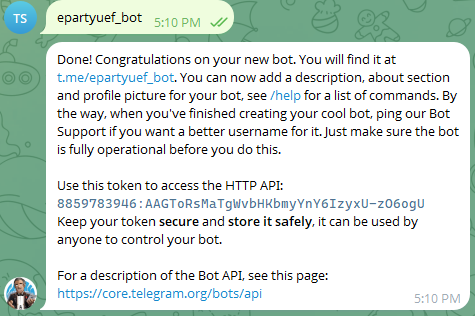

**5.2 Lấy Chat ID:** nhắn bất kỳ tin nhắn cho bot, truy cập `https://api.telegram.org/bot<TOKEN>/getUpdates`, tìm `"id"` trong `"chat"`.

**5.3 Thêm vào `Web.config` (`<appSettings>`) — dùng chung cho cả 2 module:**

```xml
<add key="Telegram.BotToken" value="YOUR_BOT_TOKEN_HERE" />
<add key="Telegram.ChatId" value="YOUR_CHAT_ID_HERE" />
<add key="ApiGatewayTelegramAlert.Enabled" value="true" />
<add key="PublicBaseUrl" value="https://your-ngrok-url.ngrok-free.dev" />
```

> ⚠️ Không commit token thật, Gmail App Password hoặc secret lên GitHub.

**5.4 `TelegramHelper.cs` (nếu chưa đọc từ Web.config):**

```csharp
private static readonly string BotToken = "YOUR_BOT_TOKEN_HERE";
private static readonly string ChatId   = "YOUR_CHAT_ID_HERE";
```

---

### Bước 6 — Mở & build project Web

1. Mở **Visual Studio 2022** → **Open a project or solution** → `eParty.sln`
2. Click chuột phải Solution → **Restore NuGet Packages**
3. Build: `Ctrl + Shift + B`

---

## ▶️ Chạy toàn bộ hệ thống

> ⚠️ **Phải khởi động đúng thứ tự — cả 2 Flask API trước khi mở website**

### 1️⃣ Flask — SQL Injection Detector (port 5000)

```cmd
cd sql_injection_ml
..\venv\Scripts\activate
python app.py
```

> 🖼️ **Flask Module 1 khởi động thành công, đang nhận request `/predict`:**
>
> 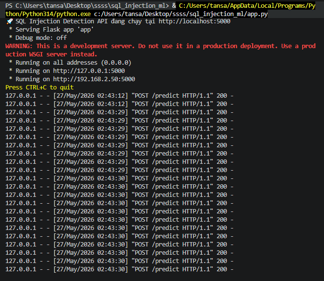

### 2️⃣ Flask — API Gateway Detector (port 5001)

```cmd
cd api_gateway_ml
..\venv\Scripts\activate
python api_gateway_detector.py
```

> 🖼️ **Flask Module 2 khởi động — load model RandomForest, 13 features, 2 nhãn (normal/abnormal):**
>
> 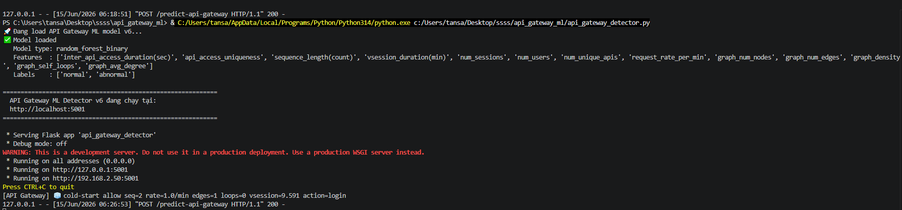

### 3️⃣ Khởi động Website ASP.NET

Trong Visual Studio: chuột phải `eParty` → **Set as Startup Project** → `F5`

Website mở tại `https://localhost:44350`

### 4️⃣ (Tùy chọn) Bật ngrok cho Telegram & Dashboard từ điện thoại

```cmd
ngrok http --host-header=rewrite https://localhost:44350
```

Đăng ký webhook (thay URL ngrok của bạn):
```
https://api.telegram.org/bot<TOKEN>/setWebhook?url=https://YOUR_NGROK_URL/TelegramWebhook
```

> 🖼️ **ngrok tunnel active — SQL Injection dùng webhook callback nhận lệnh Whitelist/Bỏ qua từ Telegram (200 OK):**
>
> 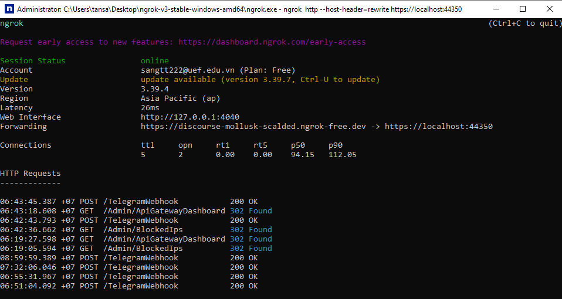

> 💡 ngrok free tier đổi URL mỗi lần restart → phải đăng ký lại webhook và cập nhật `PublicBaseUrl` trong `Web.config`.

---
---

# 🛡️ MODULE 1 — SQL Injection Detection

Phát hiện và ngăn chặn tấn công SQL Injection theo thời gian thực với **3 lớp phòng thủ**:

- **Lớp 1 — Rule-based Filter:** Chặn ngay các pattern SQLi rõ ràng (nhanh, không cần gọi API)
- **Lớp 2 — ML Model (XGBoost):** Phát hiện các biến thể tinh vi, obfuscated payloads
- **Lớp 3 — Admin Review (Telegram):** Cho phép Admin xem xét và whitelist false positive theo thời gian thực

### 🎯 Tính năng nổi bật

| Tính năng | Mô tả |
|-----------|-------|
| **3 lớp bảo vệ** | Rule-based → ML Model → Admin Review |
| **Phát hiện đa dạng** | Classic, Union-based, Time-based, Error-based, Obfuscated SQLi |
| **Hỗ trợ tiếng Việt** | Không chặn nhầm mô tả tiệc cưới, menu, chi phí, teambuilding |
| **Telegram Bot** | Alert real-time với nút ✅ Whitelist / ❌ Bỏ qua cho Admin |
| **Auto-retry** | Sau khi Admin whitelist, trang tự động retry request gốc |
| **Polling** | Trang 403 tự polling 3 giây, phát hiện approval → redirect |
| **Dashboard log** | Ghi đầy đủ IP, URL, payload, loại tấn công vào database |
| **Webhook callback** | Admin bấm nút Telegram → whitelist ngay không cần đăng nhập web |

### 🏗️ Kiến trúc xử lý

```
┌─────────────────────────────────────────────────────────────┐
│              SqlInjectionFilter (ActionFilter)               │
│                                                                │
│  Bước 0: Bypass whitelist (SQLInjectionLog, TestPage)         │
│  Bước 1: Dynamic Whitelist — payload đã được Admin duyệt?     │
│  Bước 2: Rule-based (raw input) — pattern rõ ràng?            │
│  Bước 3: Normalize (decode URL, strip /**/ comments)          │
│  Bước 4: Rule-based (normalized) — sau khi unescape?          │
│  Bước 5: Vietnamese Whitelist — text tiếng Việt thuần túy?    │
│  Bước 6: Flask ML API (XGBoost) — prob > 0.55?                │
└──────────────────────────────────────────────────────────────┘
          │ Bị chặn                        │ An toàn
          ▼                                ▼
┌──────────────────────┐         ┌──────────────────────┐
│  Ghi log vào DB       │         │  Request xử lý       │
│  Hiện trang 403       │         │  bình thường ✅       │
│  Lưu PendingWhitelist │         └──────────────────────┘
└──────────┬────────────┘
           │ User bấm "Báo cáo Sai"
           ▼
┌──────────────────────┐
│  Telegram Bot Alert  │
│  ✅ Whitelist  ❌ Bỏ qua │
└──────────┬────────────┘
           │ Admin bấm ✅
           ▼
┌──────────────────────┐
│  Webhook callback     │
│  → Whitelist token    │
│  → Polling phát hiện  │
│  → Auto-retry request │
└──────────────────────┘
```

### 🔄 Luồng hoạt động đầy đủ

```
1. Người dùng submit form có chứa nội dung đáng ngờ
2. SqlInjectionFilter chặn → trang 403
   (Lưu token + returnUrl + formData vào PendingWhitelists)
3. Người dùng bấm "Báo cáo Sai cho Admin"
4. Telegram nhận alert với payload đầy đủ + 2 nút bấm
   ✅ Whitelist payload này    ❌ Bỏ qua
5. Admin bấm ✅ → Webhook /TelegramWebhook nhận callback
   → AddToWhitelist(payload), đánh dấu token IsUsed = true
6. Trang 403 polling mỗi 3 giây phát hiện IsUsed = true
   → Tự động replay request gốc (GET redirect / POST form submit)
7. Request thực hiện thành công ✅ — không cần nhập lại gì
```

### 🧪 Cách test

Truy cập `https://localhost:44350/SqlInjectionTest/Index`, dán payload và chọn chế độ:

| Chế độ | Mô tả |
|--------|-------|
| **Only ML** | Kiểm tra thuần bằng XGBoost Model |
| **Full Filter** | Giả lập filter thực tế (Rule-based + ML) |

> 🖼️ **Trang test payload với chế độ Full Filter — 20 payloads đều bị chặn:**
>
> 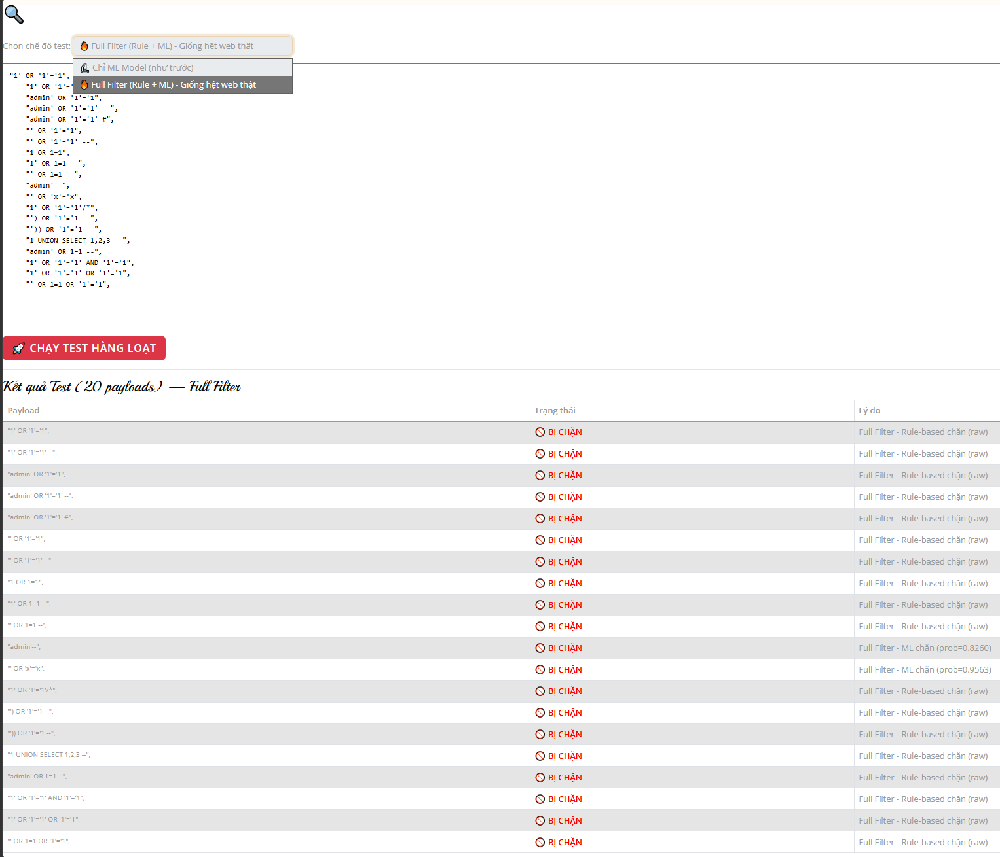

**Payload mẫu:**

```sql
-- Nên bị chặn (MALICIOUS)
' OR 1=1 --
UNION SELECT username, password FROM users --
'; DROP TABLE Events; --
CAST((SELECT password FROM users) AS int)
1' AND (SELECT COUNT(*) FROM information_schema.tables) > 0 --
WAITFOR DELAY '0:0:5'--
admin'/**/OR/**/1=1--

-- Không nên bị chặn (BENIGN)
Tiệc cưới ngoài trời với view sông, menu 8 món, 120 khách
Tôi muốn đặt tiệc sinh nhật cho bé gái 8 tuổi, chủ đề công chúa
Teambuilding công ty ABC vào ngày 20/05/2026 tại Quận 7
```

> 🖼️ **Trang 403 hiển thị khi request bị chặn:**
>
> 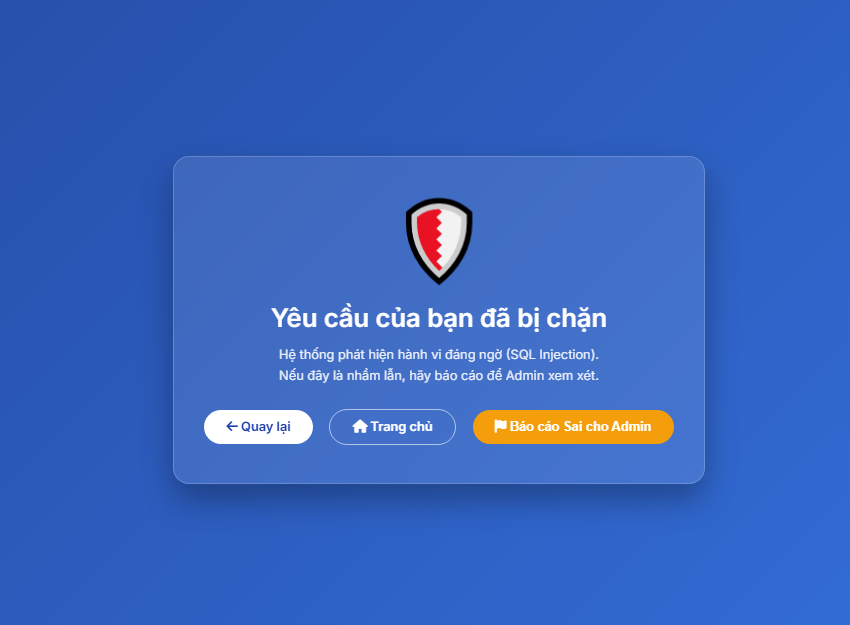

> 🖼️ **Telegram alert với payload đầy đủ + nút Whitelist / Bỏ qua:**
>
> 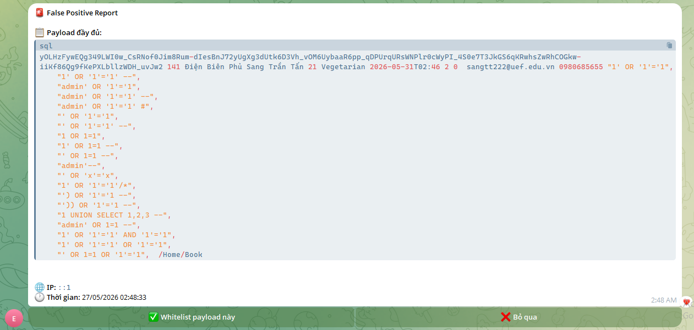

> 🖼️ **Dashboard log — lọc theo Tất cả / Rule-based / ML Model / Blocked:**
>
> 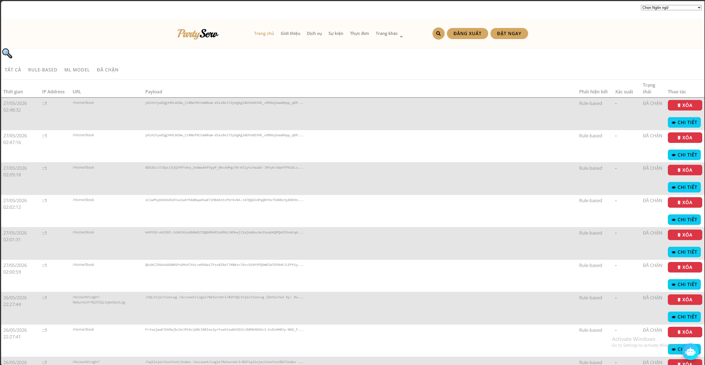

### 🔍 Chi tiết kỹ thuật

**Rule-based Filter** — Literal patterns (so sánh chuỗi):
```
or 1=1, union select, drop table, information_schema,
cast(, convert(, sleep(, benchmark(, @@version, xp_cmdshell, ...
```
Regex patterns (compiled, tái sử dụng):
```regex
cast\s*\(.+?as\s+int
union\s*/\*+\*/\s*select
0x[0-9a-f]{2,}
select\s+.+\s+from\s+\w+
;\s*(drop|delete|update|insert)\s+
```

**Normalize Input** — trước khi kiểm tra rule:
1. URL decode nhiều lần (chống double encoding: `%2527` → `%27` → `'`)
2. Strip SQL comments `/*...*/` bằng chuỗi rỗng (không phải space): `SE/**/LECT` → `SELECT` ✅
3. Normalize whitespace

**ML Model:**

| Thành phần | Chi tiết |
|-----------|---------|
| Thuật toán | XGBoost Classifier |
| Feature extraction | TF-IDF (char_wb, n-gram 1-3, max 5000 features) |
| Dataset | [Modified SQL Injection Dataset](https://www.kaggle.com/datasets/sajid576/sql-injection-dataset) (Kaggle) |
| Threshold | `probability > 0.55` → chặn |
| Timeout | 1500ms (fallback: cho qua nếu Flask không phản hồi) |

**Dynamic Whitelist:** lưu trong bộ nhớ (in-memory `List<string>`), nạp khi Admin phê duyệt qua Telegram. Reset khi restart IIS — nếu cần persistent, lưu vào DB và load lại khi khởi động.

### 📊 Kết quả Model

| Metric | XGBoost | RandomForest |
|--------|---------|--------------|
| Accuracy (Test) | **99.69%** | **99.43%** |
| Precision (SQLi) | 99.96% | 100% |
| Recall (SQLi) | 99.21% | 98.46% |
| F1-score (SQLi) | 99.58% | 99.23% |
| False Positive (Tiếng Việt) | Thấp (có whitelist) | Trung bình |
| Tốc độ inference | ~5ms | ~8ms |

> 🖼️ **Kết quả huấn luyện XGBoost & RandomForest và Super Stress Test (40+ cases):**
>
> 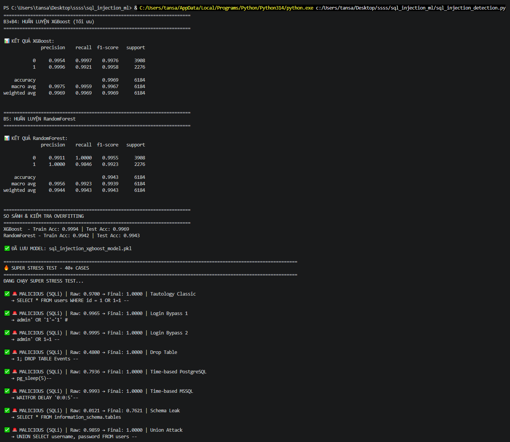

*XGBoost được chọn là model chính do accuracy cao hơn (99.69% vs 99.43%) và train acc (99.94%) gần với test acc, chứng tỏ không bị overfit.*

---
---

# 🛡️ MODULE 2 — API Gateway Security

Lớp phòng thủ thứ hai, hoạt động **độc lập với Module 1**, tập trung vào **hành vi truy cập** thay vì nội dung payload — phát hiện spam/flood request, chống bot, giới hạn tốc độ và tự động khóa IP tạm thời.

Mô-đun kết hợp:

- **ASP.NET MVC Action Filter** chặn request trước khi vào Controller
- **Realtime Feature Extraction** tính hành vi truy cập theo session và IP
- **Flask ML Detector** (RandomForest, binary normal/abnormal) dự đoán bất thường
- **Rule Engine** quyết định rate-limit/block
- **Temporary Blocked IP** khóa IP tạm thời
- **Admin Dashboard** giám sát realtime
- **Telegram Alert** cảnh báo khi tạo block mới

### 🎯 Mục tiêu

| Loại hành vi | Cách xử lý |
|---|---|
| Request bình thường | Cho phép truy cập |
| Request có rủi ro ML cao | Monitor và ghi log |
| Request spam liên tục | Trả HTTP **429** Rate Limit |
| IP tiếp tục spam sau rate-limit | Trả HTTP **403** Temporary Block |
| ML Detector bị tắt/offline | Website vẫn hoạt động, dashboard báo Offline |
| IP bị khóa | Admin xem và Unblock trong trang quản trị |
| Tấn công xảy ra | Gửi Telegram alert realtime |

### 🏗️ Kiến trúc xử lý

```
Client Request
      │
      ▼
ASP.NET MVC ApiGatewayMlFilter
      │
      ▼
Realtime Feature Extraction
      │
      ▼
Flask API Gateway ML Detector (:5001)
      │
      ▼
ML Prediction + Rule Engine
      │
      ▼
Decision: allow / monitor / challenge_or_rate_limit / block
      │
      ▼
Temporary Blocked IP Policy
      │
      ▼
Save Logs to Database
      │
      ▼
Admin Dashboard + Telegram Alert
```

### 🧠 Realtime Features (13 features)

| Feature | Ý nghĩa |
|---|---|
| `inter_api_access_duration` | Thời gian giữa 2 request liên tiếp |
| `api_access_uniqueness` | Tỷ lệ API khác nhau đã truy cập |
| `sequence_length` | Số request trong chuỗi hiện tại |
| `vsession_duration` | Thời lượng session |
| `num_sessions` | Số session đang hoạt động theo IP |
| `num_users` | Số user đang hoạt động theo IP |
| `num_unique_apis` | Số API khác nhau đã gọi |
| `request_rate_per_min` | Số request/phút |
| `graph_num_nodes` | Số node trong graph API |
| `graph_num_edges` | Số cạnh trong graph API |
| `graph_density` | Mật độ graph |
| `graph_self_loops` | Số lần gọi lặp lại cùng API |
| `graph_avg_degree` | Bậc trung bình của graph |

Các feature này được gửi sang Flask API Gateway Detector để dự đoán hành vi bất thường.

### 🤖 Flask API Gateway ML Detector

Chạy tại port `5001`:

```
POST http://localhost:5001/predict-api-gateway
GET  http://localhost:5001/health
```

Model: `random_forest_binary` — Labels: `normal` / `abnormal` — 13 features — Dataset: [API Access Behaviour Anomaly](https://www.kaggle.com/datasets/tangodelta/api-access-behaviour-anomaly-dataset)

> 🖼️ **Flask Detector khởi động — load model, log realtime mỗi request (`cold-start allow`):**
>
> 

### 📊 Admin Dashboard

Truy cập `/Admin/ApiGatewayDashboard` — hiển thị:

- Tổng số log / Log trong ngày / Log 24h gần nhất / Average Risk
- ML Detector Online/Offline, Model Type, Feature Count
- Allow / Monitor / Rate Limited / Block Logs
- Active Blocked IPs / Total Blocked IP Records
- Biểu đồ Request theo giờ + phân bố Action
- Top IP / Top Route

> 🖼️ **Dashboard khi ML Detector Online:**
>
> 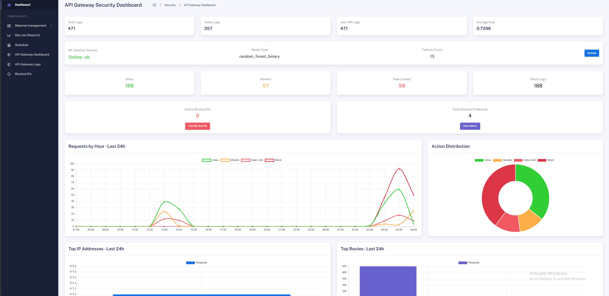

> 🖼️ **Dashboard khi ML Detector Offline — website vẫn hoạt động, chỉ báo lỗi kết nối:**
>
> 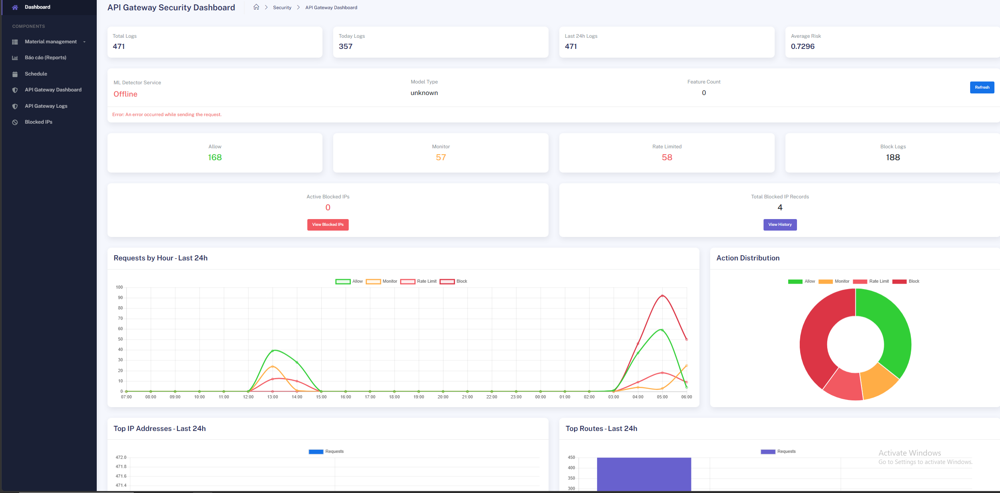

### 🧪 Test phòng thủ — Spam 80 request

```powershell
for ($i = 1; $i -le 80; $i++) {
    $code = curl.exe -k -s -o NUL -w "%{http_code}" https://localhost:44350/Home/Index
    Write-Host "$i => $code"
}
```

| Giai đoạn | HTTP Code | Ý nghĩa |
|---|---:|---|
| Request bình thường (1-25) | `200` | Cho phép truy cập |
| Spam vượt ngưỡng (26-34) | `429` | Rate Limit |
| Tiếp tục spam (35-80) | `403` | Temporary Block IP |

> 🖼️ **Kết quả test 80 request: 200 → 429 → 403:**
>
> 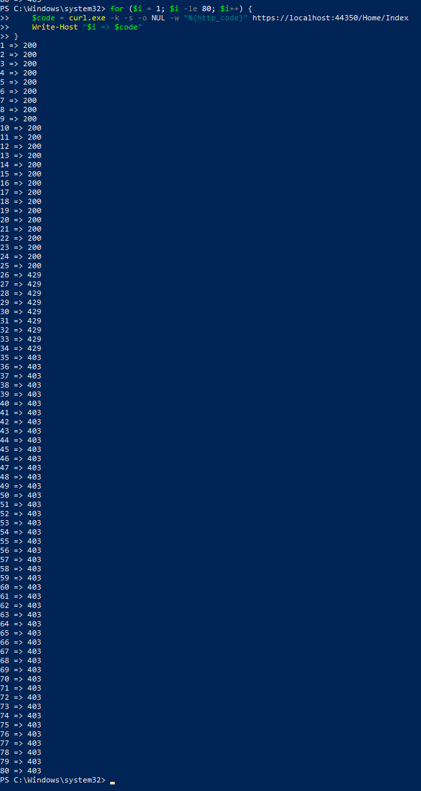

### 📋 API Gateway Logs

Truy cập `/Admin/ApiGatewayLogs` — lọc theo IP, Final Action, Predicted Label, Decision Source, khoảng thời gian.

**Cột chính:** IP, Route, Risk Score, Predicted Label, Final Action, Decision Source, Request Rate/min, Sequence Length, Graph Self Loops, Created At

**Action:** `allow` / `monitor` / `challenge_or_rate_limit` / `block`

**Decision Source:** `normal` / `cold_start_allow` / `ml_monitor` / `ml_high_risk_monitor` / `rule_rate_limit` / `temporary_ip_block_created` / `temporary_ip_block`

> 🖼️ **API Gateway Logs — có chức năng Log Maintenance (xóa log cũ/toàn bộ) và bộ lọc đầy đủ:**
>
> 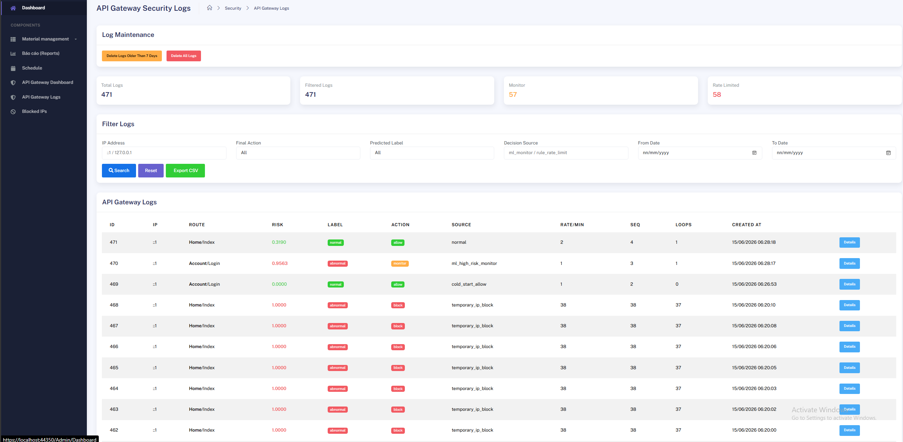

### 🚫 Temporary Blocked IPs

Khi IP bị rate-limit nhiều lần trong thời gian ngắn, hệ thống tự động khóa tạm thời. Truy cập `/Admin/BlockedIps`.

**Thông tin lưu lại:** IP Address, Status, Source, Challenge Count, Blocked Requests, Created At, Blocked Until, Reason. Admin có thể bấm **Unblock** để mở khóa thủ công.

> 🖼️ **IP đang bị khóa tạm thời (status Active):**
>
> 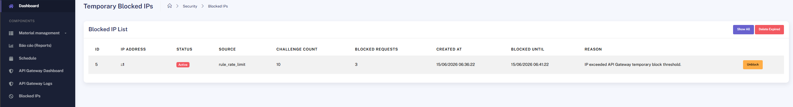

> 🖼️ **Admin xác nhận Unblock IP:**
>
> 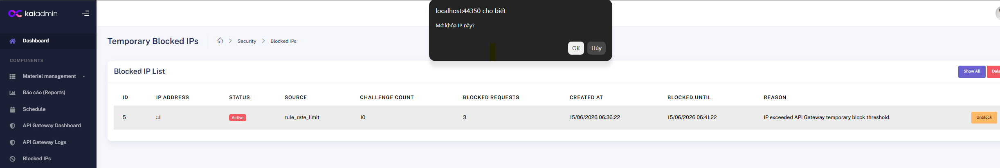

> 🖼️ **Sau khi Unblock — danh sách trống:**
>
> 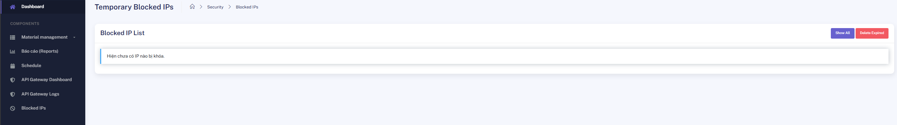

### 📲 Telegram Alert

Khi hệ thống tạo temporary block mới, Telegram Bot gửi cảnh báo realtime gồm: IP bị khóa, Route bị spam, Decision Source, Risk Score, Request Rate, Sequence Length, Graph Self Loops, Challenge Count, Blocked Until, Created At.

> ℹ️ Khác với Module 1 (dùng webhook callback để Whitelist), API Gateway Telegram Alert chỉ dùng **URL button** để mở Admin Dashboard / Blocked IPs qua ngrok — không xử lý callback từ Telegram.

Nếu cấu hình `PublicBaseUrl` bằng ngrok, Telegram hiển thị thêm 2 nút: **Open Blocked IPs** và **Open API Gateway Dashboard**.

> 🖼️ **Telegram alert khi API Gateway tạo Temporary Block — có nút mở Dashboard:**
>
> 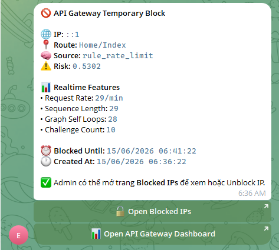

### 📤 Export CSV

Trang Logs có nút **Export CSV** xuất các cột: `Id, IpAddress, Controller, ActionName, RiskScore, PredictedLabel, FinalAction, DecisionSource, RequestRatePerMin, SequenceLength, GraphSelfLoops, CreatedAt`

> 🖼️ **File CSV xuất ra từ API Gateway Logs:**
>
> 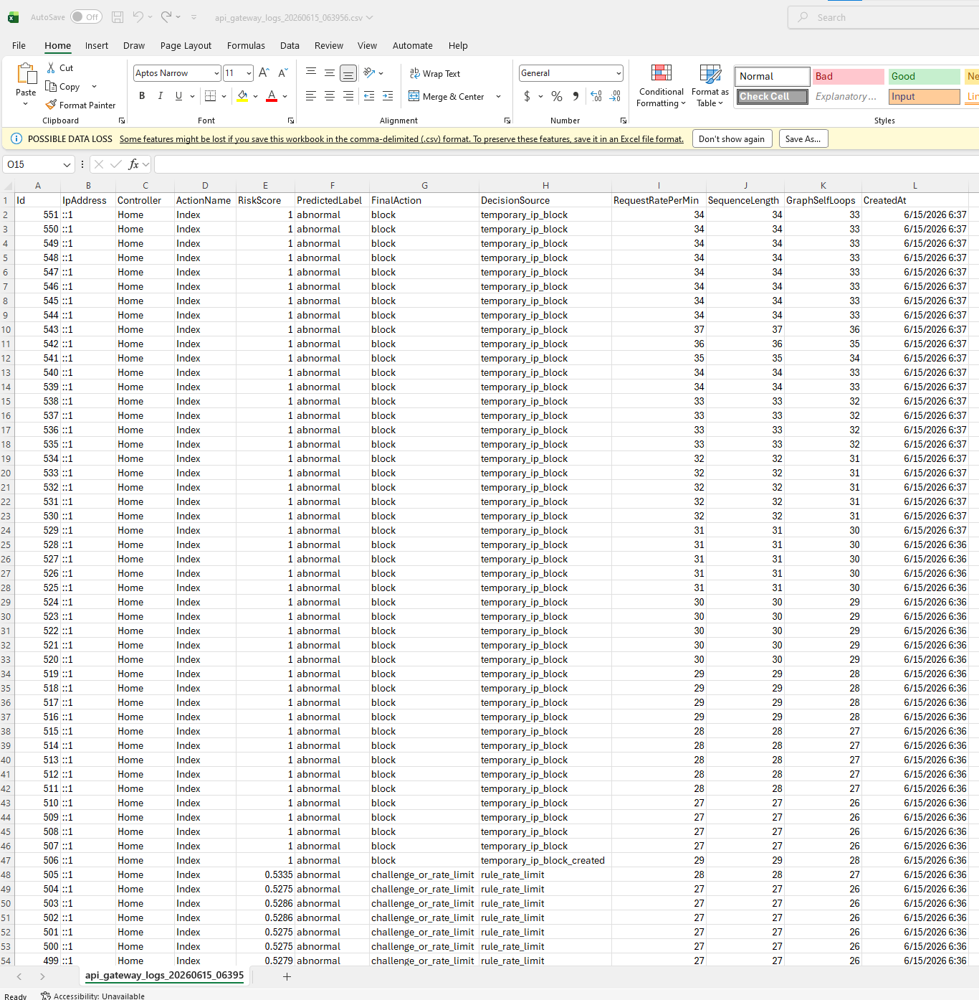

### 🌐 Ngrok Public URL

```cmd
ngrok http --host-header=rewrite https://localhost:44350
```

```xml
<add key="PublicBaseUrl" value="https://your-ngrok-url.ngrok-free.dev" />
```

> 🖼️ **ngrok tunnel active — SQL Injection dùng webhook callback, API Gateway dùng URL button mở Dashboard/Blocked IPs (302/200 OK):**
>
> 

### 🧪 Kịch bản demo

| Bước | Thao tác | Kết quả |
|---|---|---|
| 1 | Chạy Flask API Gateway Detector | Model Online |
| 2 | Mở Admin Dashboard | Hiển thị ML Detector Online |
| 3 | Chạy 80 request bằng PowerShell | 200 → 429 → 403 |
| 4 | Mở API Gateway Logs | Thấy allow/rate-limit/block |
| 5 | Mở Blocked IPs | Thấy IP đang Active |
| 6 | Kiểm tra Telegram | Nhận alert có nút mở dashboard |
| 7 | Bấm Unblock | IP được mở khóa |
| 8 | Tắt Flask | Dashboard báo Offline nhưng web không crash |

### ✅ Kết quả đạt được

```
✅ Phát hiện request bất thường bằng ML
✅ Giám sát request theo IP và session
✅ Chống spam/flood request
✅ Rate limit bằng HTTP 429
✅ Khóa IP tạm thời bằng HTTP 403
✅ Ghi log vào database
✅ Dashboard thống kê realtime
✅ Quản lý Blocked IPs
✅ Export CSV
✅ ML health check Online/Offline
✅ Telegram alert realtime
✅ Hỗ trợ ngrok để mở dashboard từ Telegram
```

### ⚠️ Giới hạn hiện tại

Module tập trung chống: request flood, spam cùng route, request rate bất thường, hành vi truy cập lặp lại theo IP/session.

Chưa thay thế API Security chuyên sâu: Broken Authentication, Broken Authorization/IDOR, JWT abuse, SSRF, File upload attack, Business logic abuse.

Với mục tiêu **nghiên cứu bảo vệ API Gateway bằng Machine Learning**, module hiện tại đã đáp ứng: phát hiện, rate-limit, temporary block, logging, monitoring và realtime alert.

---
---

## 🛠️ Khắc phục lỗi chung

<details>
<summary><b>❌ Lỗi: <code>No module named flask</code> / xgboost / sklearn...</b></summary>

Chạy lại trong môi trường ảo đã activate:
```cmd
pip install flask pandas scikit-learn xgboost joblib numpy
```
</details>

<details>
<summary><b>❌ Lỗi: Không tìm thấy file <code>.pkl</code></b></summary>

Kiểm tra các file `.pkl` đang nằm đúng thư mục `models/` của từng Flask service:
```
sql_injection_ml\models\sql_injection_xgboost_model.pkl
sql_injection_ml\models\tfidf_vectorizer.pkl

api_gateway_ml\models\api_gateway_model.pkl
api_gateway_ml\models\api_gateway_features.pkl
api_gateway_ml\models\api_gateway_labels.pkl
api_gateway_ml\models\api_gateway_model_type.pkl
```
</details>

<details>
<summary><b>❌ Lỗi: Website load mãi không ra (ML timeout)</b></summary>

Đảm bảo **cả 2 Flask** đang chạy trước khi mở website:
```
🚀 SQL Injection Detection API đang chạy tại http://localhost:5000
🚀 API Gateway ML Detector đang chạy tại http://localhost:5001
```
Nếu một trong hai Flask không chạy, hệ thống vẫn hoạt động (fallback cho qua/allow), dashboard tương ứng sẽ báo **Offline**.
</details>

<details>
<summary><b>❌ Lỗi: Telegram không nhận tin nhắn</b></summary>

1. Kiểm tra bot token: `https://api.telegram.org/bot<TOKEN>/getMe` phải trả về `{"ok": true, ...}`
2. Xem **Output window** (Ctrl+Alt+O) trong Visual Studio, tìm dòng `[Telegram]`.
3. `TaskCanceledException` nghĩa là Flask timeout.
</details>

<details>
<summary><b>❌ Lỗi: Nút Telegram bấm không có tác dụng</b></summary>

Webhook chưa đăng ký hoặc ngrok đã đổi URL:
```
https://api.telegram.org/bot<TOKEN>/getWebhookInfo
```
Nếu `url` trống/sai → đăng ký lại webhook + cập nhật `PublicBaseUrl` trong `Web.config`.
</details>

<details>
<summary><b>❌ Lỗi: <code>Bad Request - Invalid Hostname</code> khi qua ngrok</b></summary>

Dùng `--host-header=rewrite`:
```cmd
ngrok http --host-header=rewrite https://localhost:44350
```
Hoặc thêm binding trong `applicationhost.config`:
```xml
<binding protocol="https" bindingInformation="*:44350:" />
```
</details>

---

## 📊 Kết quả tổng thể

| | Module 1 — SQL Injection | Module 2 — API Gateway Security |
|---|---|---|
| Accuracy | 99.69% (XGBoost) | Random Forest binary classifier |
| Phát hiện | Payload SQLi (Union, Time-based, Obfuscated...) | Spam/Flood/Bot theo hành vi truy cập |
| Hành động | Block 403 + Telegram Whitelist Review | 429 Rate Limit → 403 Temporary Block |
| Giám sát | Dashboard `/SQLInjectionLog` | Dashboard + Logs + Blocked IPs (Admin Area) |
| Cảnh báo | Telegram (payload + Whitelist/Bỏ qua) | Telegram (Temporary Block + link Dashboard) |
| Fail-safe | Cho qua nếu Flask :5000 offline | Allow + Dashboard báo Offline nếu Flask :5001 offline |

Hai module hoạt động **độc lập, không phụ thuộc lẫn nhau** — đảm bảo nếu một lớp gặp sự cố, website vẫn hoạt động bình thường và lớp còn lại tiếp tục bảo vệ hệ thống.

---

## 🤝 Đóng góp

Nếu gặp lỗi hoặc muốn cải thiện, hãy mở [Issue](https://github.com/sangtran121/eparty-security-ml/issues) kèm:
- Ảnh chụp màn hình lỗi (ghi rõ Module 1 hay Module 2)
- Payload / request gây ra vấn đề
- Dòng log trong Output window của Visual Studio hoặc console Flask

---

<div align="center">

Được xây dựng trong môn học Lập trình Web — **Nhóm eParty** 🎉

</div>
